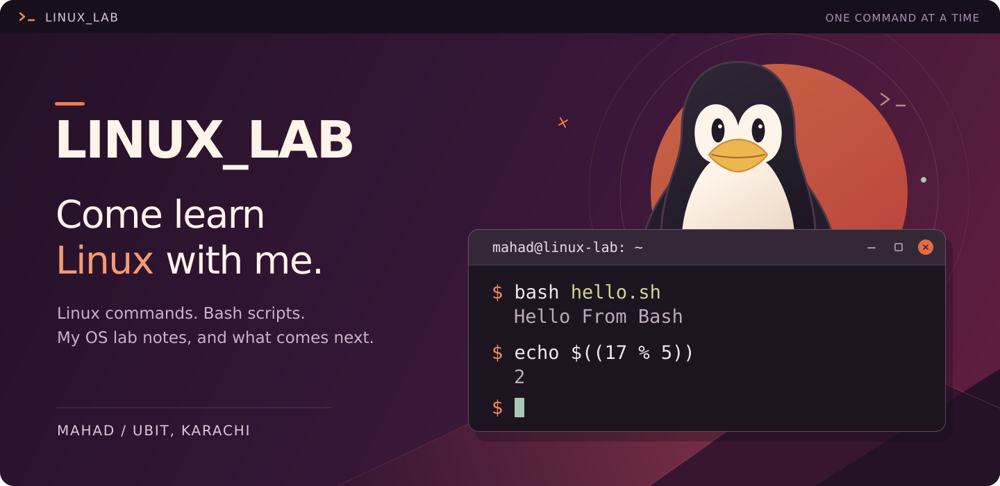
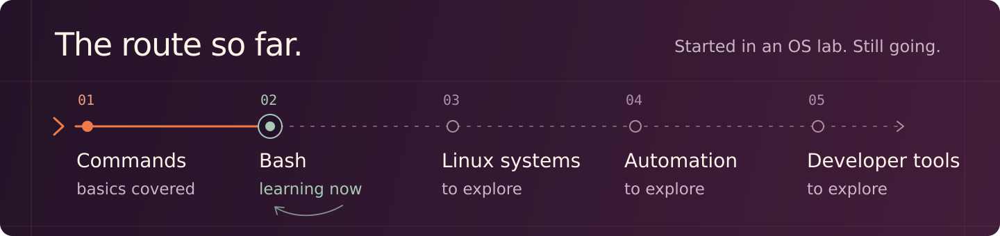
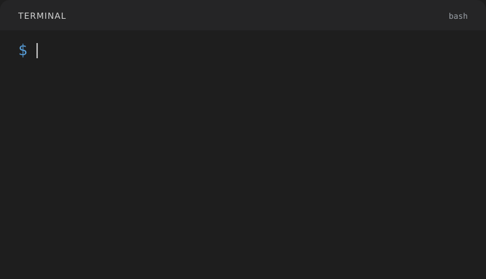

<div align="center">

<picture>
  <source media="(max-width: 600px)" srcset="assets/linux-lab-hero-mobile.svg">
  
</picture>

**Linux commands, Bash scripts, and the things I'll learn along the way.**

[My story](#hey-im-shaikh-mahad-) · [Set up Linux](#get-a-linux-terminal) · [Learning map](#what-im-learning) · [Try a script](#lets-run-something)

</div>

# LINUX_LAB

## Hey, I'm Shaikh Mahad 👋

I'm a **BS Software Engineering student at UBIT, University of Karachi**. This repo started with the Linux and shell scripting part of my **Operating Systems lab**. I wanted somewhere to keep my notes, practise the commands, and come back to them before a lab or exam.

But I want to keep going after the course. I want to understand the system I'm writing code on: how files and permissions work, what a process is doing, and how to write a script that saves me doing the same job again tomorrow. This is where I'll work through that, one topic at a time.

I'm putting it here so it can help someone else too. **If you're taking an OS course, learning for a project, or just curious about Linux, come learn with me.** Open a chapter, try the examples, change a few things, and see what happens. You can start from zero.

> **Currently at:** [Bash 04: Operators and Expressions](learning/bash-scripting/04-operators-and-expressions/README.md)
>
> **In the notebook:** 4 Linux command chapters · 4 Bash chapters · 14 example scripts.

## First, a little about Linux


You'll see these three names a lot here:

**Linux** is the kernel: the core that helps software work with the computer's hardware. People also say “Linux” when they mean a whole operating system built around it.

**Ubuntu** is one of those complete systems, called a *distribution*. It gives you Linux together with a desktop, applications, and tools. **Bash** is a shell: it reads your commands and runs them. Save those commands in a file, and you have the beginnings of a script.

For me, that's the interesting part: learning a command today, then finding a way to use it in my own work.

<sub>More about [Linux](https://www.kernel.org/linux.html), [Ubuntu](https://ubuntu.com/about), and [Bash](https://www.gnu.org/software/bash/manual/html_node/What-is-Bash_003f.html).</sub>

<br clear="right">

## Get a Linux terminal

<a href="https://ubuntu.com/desktop"></a>

You can keep your current operating system. Pick the setup that fits what you want to try. The steps below use Ubuntu, so we have a common starting point for commands, package names, and examples.

<br clear="right">

| If you want… | Start with… |
| :--- | :--- |
| Linux commands and Bash on a Windows computer | **Ubuntu in WSL** is enough for the current lessons. |
| The full Ubuntu desktop to explore alongside the terminal | **Ubuntu in a virtual machine** runs a separate OS in a window. |
| To use Linux you already have installed | Open a terminal, run `bash --version`, and [jump to the examples](#lets-run-something). |

<details>
<summary><strong>🪟 Windows + WSL: set up the terminal</strong></summary>

These steps are for **Windows 11**, or **Windows 10 version 2004 / build 19041 or later**.

1. Open **PowerShell as administrator**. Run:

   ```powershell
   wsl --install -d Ubuntu
   ```

2. Restart when prompted, then open **Ubuntu** from the Start menu.
3. Create your Linux username and password. Nothing appears while you type the password, even dots. That's normal.
4. In the Ubuntu terminal, check Bash:

   ```bash
   bash --version
   ```

Run this repo's Linux commands in that Ubuntu terminal. The PowerShell command above is just for setting it up.

If installation needs troubleshooting, Microsoft's [WSL installation guide](https://learn.microsoft.com/en-us/windows/wsl/install) and [first-time setup guide](https://learn.microsoft.com/en-us/windows/wsl/setup/environment) cover the details.

</details>

<details>
<summary><strong>🖥️ Ubuntu in a virtual machine: set up the desktop</strong></summary>

A virtual machine lets you explore Ubuntu while your usual operating system is still running.

1. Install [VirtualBox](https://www.virtualbox.org/wiki/Downloads). If your lab uses VMware, [Workstation or Fusion](https://www.vmware.com/products/desktop-hypervisor/workstation-and-fusion) is another option.
2. Download **Ubuntu Desktop LTS** from [Ubuntu's download page](https://ubuntu.com/download/desktop). LTS means *long-term support*. Choose the image for your computer: Intel/AMD 64-bit for Intel/AMD machines, or ARM64 for an Apple Silicon VM.
3. Create a new VM and select the downloaded ISO as its installation image. Allocate memory and virtual disk space using Ubuntu's listed requirements, leaving enough memory for your main OS. In VirtualBox's creation wizard, choose **Skip Unattended Installation** if that option appears and you want to go through the installer yourself.
4. Start the VM and follow Ubuntu's installer.
5. Create your account, finish the installation, and restart the VM when asked. Open Ubuntu's **Terminal** app and run:

   ```bash
   bash --version
   ```

Do the installation **inside the VM window**; its virtual disk is where Ubuntu goes.

Ubuntu's [VirtualBox walkthrough](https://ubuntu.com/tutorials/how-to-run-ubuntu-desktop-on-a-virtual-machine-using-virtualbox) shows the screens. Use a VM application and Ubuntu image that both support your computer's architecture.

</details>

## What I'm learning



The route I have in mind is **commands → Bash → Linux systems → automation → developer tools**. I'll add explanations and examples as I study and practise them. The later topics below are plans; the linked chapters are the notes you can use today.

**First time here?** Start with [Navigation and Paths](learning/linux-commands/01-navigation-and-paths/README.md). Already comfortable moving around the terminal? Try [Shell and Script Basics](learning/bash-scripting/01-shell-and-script-basics/README.md).

<details>
<summary><strong>📂 Linux commands · 4 chapters available</strong></summary>

| Chapter | What's inside |
| :--- | :--- |
| **01 · [Navigation and paths](learning/linux-commands/01-navigation-and-paths/README.md)** | `pwd`, `ls`, `cd`, paths, hidden files, quoting names, and a [guided practice route](learning/linux-commands/01-navigation-and-paths/README.md#take-a-short-trip-through-the-repo). |
| **02 · [Files and directories](learning/linux-commands/02-files-and-directories/README.md)** | `mkdir`, `touch`, `file`, `stat`, `tree`, and timestamps. |
| **03 · [Viewing file content](learning/linux-commands/03-viewing-file-content/README.md)** | `cat`, `less`, `more`, `head`, and `tail`. |
| **04 · [Copying, moving, and deleting](learning/linux-commands/04-copying-moving-and-deleting/README.md)** | `cp`, `mv`, `rm`, `rmdir`, and what their options change. |

</details>

<details>
<summary><strong>🐚 Bash scripting · 4 chapters available</strong></summary>

| Chapter | What's inside | A script to open |
| :--- | :--- | :--- |
| **01 · [Shell and script basics](learning/bash-scripting/01-shell-and-script-basics/README.md)** | Shells, shebangs, comments, running scripts, and syntax checks. | [hello.sh](learning/bash-scripting/01-shell-and-script-basics/hello.sh) |
| **02 · [Variables and expansion](learning/bash-scripting/02-variables-and-expansion/README.md)** | Variables, quoting, command substitution, and arithmetic expansion. | [quoting.sh](learning/bash-scripting/02-variables-and-expansion/quoting.sh) |
| **03 · [Input and output](learning/bash-scripting/03-input-and-output/README.md)** | `echo`, `printf`, `read`, and prompts. | [formatted-output.sh](learning/bash-scripting/03-input-and-output/formatted-output.sh) |
| **04 · [Operators and expressions](learning/bash-scripting/04-operators-and-expressions/README.md)** | Arithmetic, comparisons, logic, exit status, and command chaining. | [numeric-comparisons.sh](learning/bash-scripting/04-operators-and-expressions/numeric-comparisons.sh) |

</details>

<details>
<summary><strong>🗺️ Where I want to take this next</strong></summary>

These are the topics I want this notebook to grow into. I'll work through them over time; they aren't published lessons yet.

| Area | What I want to learn |
| :--- | :--- |
| **More command-line tools** | Finding files, searching and processing text, pipes, and redirection. |
| **More Bash** | Conditions, loops, functions, script arguments, and arrays. |
| **Working with the system** | Permissions, ownership, users, groups, processes, jobs, and signals. |
| **Everyday Linux** | System information, storage, archives, networking, and the shell environment. |
| **Better scripts** | Handling errors, debugging, checking inputs, and making scripts safer to rerun. |
| **Useful automation** | Backups, file organisation, log processing, and small system utilities. |
| **My developer workflow** | Command-line tools and scripts that help with everyday software projects. |

The small examples come first. As I get further, I want to turn them into exercises and useful scripts, and keep the notes here for revision.

</details>

<details>
<summary><strong>🗂️ How the repository is organised</strong></summary>

The published learning material is under `learning/`. The other areas below describe the layout I'm building towards.

```text
LINUX_LAB/
    learning/
        linux-commands/       # Command notes, one topic per folder
        bash-scripting/       # Bash notes and example scripts
    practice/                 # Planned: exercises to try yourself
    automation/               # Planned: scripts for useful tasks
    resources/                # Planned: references and lab material
    assets/                   # README artwork and terminal demos
    README.md                 # You are here
    LICENSE
```

Empty planned folders may not appear in a fresh clone; Git starts tracking them when files are added. The chapter links above take you to the material already available.

</details>

## Let's run something

<a href="https://git-scm.com/"></a>

Inside your Linux terminal, check that Git is available with `git --version`. If Ubuntu says the command is missing, install it:

<br clear="right">

<details>
<summary><strong>Install Git on Ubuntu</strong></summary>

```bash
sudo apt update
sudo apt install git
```

`sudo` asks for your Linux password. As during setup, the password stays invisible while you type.

</details>

Get the repository and run the first script:

```bash
git clone https://github.com/codewithmahad/LINUX_LAB.git
cd LINUX_LAB
bash learning/bash-scripting/01-shell-and-script-basics/hello.sh
```

It prints `Hello From Bash`. Already cloned the repo? Open its directory and run the last command.

My suggestion: read a small section, guess what its example will do, then run it. Change a value or an option and try again. Keep a scratch directory for file exercises, especially when practising `rm`: it doesn't send files to the desktop Trash.

### Make the first script your own

<a href="https://www.gnu.org/software/bash/">
  <picture>
    <source media="(prefers-color-scheme: dark)" srcset="assets/logos/bash-dark.svg">
    
  </picture>
</a>

Open `hello.sh` in your editor. Change the greeting, save it, and run the same command again. Then try printing two lines instead of one. That's a small change, but now you're editing a program and checking what it does.

When you move on to variables, replace the fixed greeting with a name stored in a variable. After input and output, try asking the person running it for their name. The same tiny script can grow with you.

[Start with the script basics](learning/bash-scripting/01-shell-and-script-basics/README.md) · [Give it variables](learning/bash-scripting/02-variables-and-expansion/README.md) · [Make it ask a question](learning/bash-scripting/03-input-and-output/README.md)

<br clear="right">

<details>
<summary><strong>Try this from my current chapter: why does “true” give 0?</strong></summary>

Run this in Bash:

```bash
printf 'Division: %s\n' "$((17 / 5))"
printf 'Remainder: %s\n' "$((17 % 5))"
(( 17 > 5 ))
printf 'Exit status: %s\n' "$?"
```

Output:

```text
Division: 3
Remainder: 2
Exit status: 0
```

Bash's built-in arithmetic uses integers, so division gives `3` and the remainder is `2`. The comparison is true, and the command reports success with an **exit status of `0`**.

Change `>` to `<` and run the block again. The last number becomes `1`. `$?` reads the status of the command that just ran, so check it immediately after the comparison.

[Open the full chapter →](learning/bash-scripting/04-operators-and-expressions/README.md)

</details>

<div align="center">
<picture>
  <source media="(prefers-reduced-motion: reduce)" srcset="assets/terminal-playground.svg">
  
</picture>
</div>

## A comfortable place to practise

<a href="https://code.visualstudio.com/"></a>

Use an editor you already like. If that's **VS Code**, a useful layout is the chapter notes beside your script, with a terminal underneath. Read a little, edit a little, run it, and keep the result in view.

Open the cloned `LINUX_LAB` folder. From **Terminal → New Terminal**, choose a Bash terminal. On Windows with WSL, open the project through the **WSL extension** so the commands run in Ubuntu.

The [VS Code terminal guide](https://code.visualstudio.com/docs/terminal/basics) and [WSL walkthrough](https://code.visualstudio.com/docs/remote/wsl) show how to set that up. The examples here also work in a separate Ubuntu terminal if you prefer.

<br clear="right">

### Three small wins to work towards

| Try to do this without looking it up | Where to practise |
| :--- | :--- |
| Find your current directory, move to its parent, and return to where you were. | [Navigation and paths](learning/linux-commands/01-navigation-and-paths/README.md) |
| Explain what changes when you use single quotes instead of double quotes around a variable. | [Variables and expansion](learning/bash-scripting/02-variables-and-expansion/README.md) |
| Predict which command runs after `&&` or `\|\|`, then check your prediction. | [Operators and expressions](learning/bash-scripting/04-operators-and-expressions/README.md) |

Being able to explain the result is a good reason to move on. If you can't yet, change the example and try again. There's no deadline here.

<details>
<summary><strong>📌 A few reminders for the next lab</strong></summary>

| Easy to forget | A useful reminder |
| :--- | :--- |
| Where a relative path begins | It starts from your current directory. Check with `pwd`. |
| Spaces in variable assignment | Use `name="Shaikh Mahad"`, with no spaces around `=`. |
| When variables expand | `echo "$name"` expands the variable; `echo '$name'` prints its name literally. |
| Running a Bash script | `bash script.sh` explicitly chooses Bash and doesn't need executable permission. |
| Checking syntax | `bash -n script.sh` checks syntax without running the script. |
| Reading an exit status | Check `$?` immediately after the command you care about. |

These reminders come from the current chapters. Follow the learning map when you want the full examples and explanations.

</details>

## If you're learning with me


Use the notes for your lab, revise a topic before an exam, or share a chapter with a friend. If you spot something wrong, please tell me. I'm learning this too.

[Open an issue](https://github.com/codewithmahad/LINUX_LAB/issues) with the chapter, the command you tried, and what happened. Corrections and clearer examples are welcome as pull requests.

If you want to come back as the notebook grows, **[give it a star](https://github.com/codewithmahad/LINUX_LAB/stargazers)**. You can also **[follow me, @codewithmahad](https://github.com/codewithmahad)**, for what I build next.

<br clear="right">

## A little about the person keeping these notes

<a href="https://github.com/codewithmahad"></a>

**Shaikh Mahad · Software Engineering student · UBIT, University of Karachi**

I want my GitHub to show the work behind what I learn: the notes, the examples I can explain, and the useful things I eventually build with them. `LINUX_LAB` is part of that. It starts with the basics and has room to grow into the Linux tools and automation I'll use as a developer.

If you like following a project as it takes shape, you're welcome to follow along. If you're here to study, I hope you leave with something you can use in your next lab or project.

**[Follow me on GitHub](https://github.com/codewithmahad)** · **[Explore my repositories](https://github.com/codewithmahad?tab=repositories)**

<br clear="right">


<div align="center">

[MIT License](LICENSE) · [Artwork and demo credits](assets/README.md) · [Back to the start](#linux_lab)

</div>
