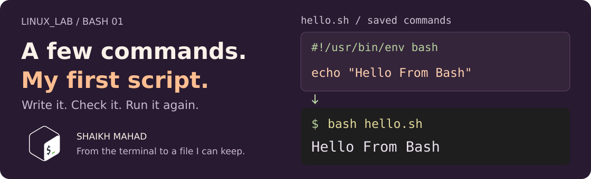

[LINUX_LAB](../../../README.md) / [Bash scripting](../../../README.md#what-im-learning) / **01**

# Shell and Script Basics

<picture>
  <source media="(max-width: 620px)" srcset="../../../assets/lessons/bash-shell-and-script-basics-mobile.svg">
  
</picture>

So far, I've been typing commands into a terminal. This is where I start keeping them in a file, so I can run them again without typing the whole thing out.

My first script just prints a greeting. The next one runs a few familiar commands in order. Small enough to read, change, and understand before I start adding variables or conditions.

[Get started](#open-the-chapter) · [Run a script](#hello-my-first-script) · [Follow the order](#a-few-commands-in-order) · [Make a copy](#your-own-copy-to-work-on) · [Check syntax](#check-script-syntax) · [Practise](#your-turn-a-lab-check-in) · [Revise](#quick-revision)

> **By the end:** run a Bash script, explain its first line, check its syntax, and make a small script of your own.
>
> **Before starting:** open a Linux terminal, including Ubuntu in WSL. [Set up Linux](../../../README.md#get-a-linux-terminal) if you need it. You only need basic [navigation](../../linux-commands/01-navigation-and-paths/README.md) and a way to [read a text file](../../linux-commands/03-viewing-file-content/README.md); you don't have to finish every Linux command chapter first.

## Terminal, shell, and Bash

These names often appear together, so here's how I separate them:

| Name | Its part in what we're doing |
| :--- | :--- |
| **Terminal** | The window or app where I type a command and see its output. Ubuntu Terminal and VS Code's terminal are examples. |
| **Shell** | The program that reads my command and carries it out. |
| **Bash** | The particular shell used in these lessons. Its name stands for *Bourne Again Shell*. |

A terminal can run different shells. Bash, Zsh, and Fish are examples; opening a terminal doesn't by itself tell you which one is running.

Check that Bash is installed:

```bash
bash --version
```

The first line includes the Bash version. Yours doesn't need to match mine exactly for these basic examples. Run the commands in a Bash terminal; if your terminal uses another shell, entering `bash` starts a Bash session. Use `exit` when you want to leave that session later.

<details>
<summary><strong>Why I don't use echo "$SHELL" to identify the current shell</strong></summary>

```bash
echo "$SHELL"
```

`SHELL` normally records your user's login shell. It can be inherited from another session, so it may still say `/bin/zsh` after you start Bash. It isn't a reliable answer to “what shell is reading this command right now?”

From a Bash session, try:

```bash
echo "$BASH_VERSION"
```

Bash sets this variable to its own version. `bash --version` reports the Bash program found through your command search path; `$BASH_VERSION` describes the Bash session you are already in. We'll get to the variable syntax in [chapter 02](../02-variables-and-expansion/README.md).

</details>

## Open the chapter

From the root of your cloned `LINUX_LAB` repo:

```bash
cd learning/bash-scripting/01-shell-and-script-basics
pwd
ls
```

There are two scripts here. Both only print information:

| Script | What I'm learning from it |
| :--- | :--- |
| [hello.sh](hello.sh) | The smallest useful starting point: give Bash a file containing a command. |
| [sequential-commands.sh](sequential-commands.sh) | Run several commands in order, including `pwd` and `date`. |

Stay in this chapter folder until we make practice copies below. If you haven't cloned the repo yet, the [home page's first-run instructions](../../../README.md#lets-run-something) get you there.

## Hello: my first script

Read the file first:

```bash
cat hello.sh
```

The file contains:

```bash
#!/usr/bin/env bash

echo "Hello From Bash"
```

Now run it:

```bash
bash hello.sh
```

```text
Hello From Bash
```

`bash` is the interpreter we're choosing. `hello.sh` is the file it should read. Bash executes the `echo` command and then finishes.

`echo` prints its arguments followed by a newline. Here the quoted text is one argument; the quote characters themselves aren't printed. This ordinary greeting is a good fit for `echo`. We'll use `printf` for more control over formatting in [Input and Output](../03-input-and-output/README.md).

### What the first line does

`#!/usr/bin/env bash` is the **shebang**. Keep it at the very start of the file, before any blank lines.

When an executable script is launched directly, that line tells the operating system which interpreter to use. Here, `/usr/bin/env` looks for `bash` through `PATH`, the list of directories used to find commands.

You'll also see `#!/bin/bash`, which points to Bash at a fixed location. The examples in this repo use the `env` form.

When you run **`bash hello.sh`**, you've already chosen Bash yourself. The shebang isn't what selects the interpreter in that invocation. This difference will matter when we try `./hello.sh` below.

### The filename is a hint

The `.sh` extension helps me recognise a shell script in the folder. It doesn't make a file executable or choose its interpreter. A script can have another extension or none at all; `hello.sh` is simply a clear name for this example.

## A few commands in order

Open the second script:

```bash
cat sequential-commands.sh
```

```bash
#!/usr/bin/env bash

echo "Script started"

# Show the working directory inherited from the terminal.
pwd
date

echo "Script finished"
```

Run it:

```bash
bash sequential-commands.sh
```

The output has this shape. The middle two lines depend on your checkout location, system clock, and date formatting:

```text
Script started
/path/to/LINUX_LAB/learning/bash-scripting/01-shell-and-script-basics
<your system's current date and time>
Script finished
```

Bash runs these ordinary foreground commands from top to bottom, waiting for each to finish before starting the next. The two `echo` lines make the beginning and end easy to spot.

That order doesn't mean every error automatically stops a script. We'll look at command results and what runs next in [Operators and Expressions](../04-operators-and-expressions/README.md#command-chaining).

### Which directory does pwd show?

It shows the **working directory the script started in**, which can be different from the folder containing the script file. Try running the same file from the parent folder:

```bash
cd ..
bash 01-shell-and-script-basics/sequential-commands.sh
cd 01-shell-and-script-basics
```

This time, the path printed by the script ends in `learning/bash-scripting`. We gave Bash a path to the script; that didn't change where it was running. The last command above returns your terminal to this chapter folder.

Both `bash script.sh` and direct execution normally run the script in another process. If a script runs `cd`, that changes its own working directory; it doesn't move your interactive terminal into another folder.

### Leave yourself a useful comment

The line starting with `# Show...` explains why `pwd` is there. Bash ignores that comment while running the script. Blank lines help me read the file; they don't print blank lines in the output.

A `#` inside quoted text is ordinary text. For example, `echo "Lab #1"` prints `Lab #1`.

I want a comment to help future me understand a choice. A sentence repeating “echo prints text” beside every `echo` wouldn't help much.

## Your own copy to work on

Before editing, copy the scripts into a practice folder. Run this from the chapter folder:

```bash
mkdir -p ~/linux-lab-practice/bash-basics
cp -i hello.sh sequential-commands.sh ~/linux-lab-practice/bash-basics/
cd ~/linux-lab-practice/bash-basics
pwd
```

`cp -i` asks before replacing a file that already exists. On a repeat visit, answer `n` to keep your earlier edits. The examples below assume the original greeting until you change it.

**Stay in this practice folder for the rest of the chapter.** Your edits belong here, and the repo's supplied examples remain available to compare against.

## Two ways to run the same script

We've already used the first way:

```bash
bash hello.sh
```

For direct execution, give yourself execute permission, then run the file:

```bash
chmod u+x hello.sh
./hello.sh
```

Both print `Hello From Bash` with the original file. `u+x` adds execute permission for the owner. If that permission was already set on your copy, this command keeps it set.

| Invocation | Who chooses the interpreter? | Execute permission on the script? |
| :--- | :--- | :--- |
| `bash hello.sh` | You explicitly choose Bash. | Not needed; Bash needs to be able to read the file. |
| `./hello.sh` | For this script, the operating system uses its shebang. | Needed, along with access to the file and its interpreter. |

### Why the dot and slash?

`./hello.sh` means the `hello.sh` file in the current directory. Typing only `hello.sh` asks the shell to look up that command name; the current directory usually isn't in `PATH`.

`./` supplies a path. It doesn't add permissions or mean “use Bash”. Those jobs belong to the execute bit and, for our directly executed script, the shebang.

Use `bash` for these lessons. Running `sh hello.sh` chooses `sh`, even though the file's first line mentions Bash. These first simple commands may work there, but later Bash syntax isn't necessarily supported by the shell called `sh`.

## Check Script Syntax

Before running an edited file:

```bash
bash -n hello.sh
```

With the supplied file, this prints nothing and succeeds. `-n` reads and checks the script's syntax **without executing its commands**. It doesn't print the greeting.

Run a separate check for the second file:

```bash
bash -n sequential-commands.sh
```

A syntax check can catch an unfinished quote. It can't tell you whether you've used the right filename or whether the greeting says what you intended. I still need to run the script and inspect its output.

<details>
<summary><strong>Try a syntax error in your practice copy</strong></summary>

Open the copied `hello.sh` in your editor. Remove the closing double quote from its `echo` line and save. The file should now look like this:

```bash
#!/usr/bin/env bash

echo "Hello From Bash
```

Run the check in your terminal:

```bash
bash -n hello.sh
```

Bash reports an error about the unfinished quotation. Its exact wording and reported line number can vary by version. No greeting runs during the check.

Put the closing `"` back in the editor, save, and run the check again. When the check is quiet, run `bash hello.sh` to confirm the greeting still works.

</details>

<details>
<summary><strong>One peek at what Bash executes</strong></summary>

```bash
bash -x sequential-commands.sh
```

Unlike `-n`, `-x` **runs** the script. It also prints a trace of commands to standard error, usually prefixed with `+`. You'll see the `echo`, `pwd`, and `date` commands alongside their normal output.

This supplied script only prints information. A trace of a different script would still perform its file changes or other actions. We'll spend more time on debugging as the scripts grow.

</details>

## Your turn: a lab check-in

Create `lab-checkin.sh` in your practice folder using your editor. If you use `nano`, open it with `nano lab-checkin.sh`; save with Ctrl+O, Enter, then leave with Ctrl+X. Any plain-text editor is fine.

Make your script:

1. Start with a Bash shebang.
2. Print a check-in message with your name.
3. Show the working directory and the current date.
4. Print what you want to learn next.
5. Include one comment explaining a useful choice.

Check its syntax, then try both ways of running it. Before you run it, predict which output lines should stay the same and which can change.

<details>
<summary><strong>Compare with my version</strong></summary>

Save this as the contents of `lab-checkin.sh` in your editor:

```bash
#!/usr/bin/env bash

# Keep a quick record of where this lab session started.
echo "Lab check-in: Shaikh Mahad"
pwd
date
echo "Next: variables and expansion."
```

Then run these commands in the terminal:

```bash
bash -n lab-checkin.sh
bash lab-checkin.sh
chmod u+x lab-checkin.sh
./lab-checkin.sh
```

The syntax check stays quiet. Each run prints four lines: the check-in message, your working directory, the date, and the next topic. The date can change between runs; the path depends on where you started the script.

Change the name and next topic so they're yours. A useful next experiment is to swap the `pwd` and `date` lines, save, and check that their output order swaps too.

</details>

## When something doesn't run

| What you see | What to check |
| :--- | :--- |
| `bash: hello.sh: No such file or directory` | Check `pwd` and `ls`. A relative path starts from your current directory. |
| `hello.sh: command not found` | Use `bash hello.sh` or, when executable, `./hello.sh`. |
| `Permission denied` with `./hello.sh` | Check the execute permission with `ls -l hello.sh`; add it with `chmod u+x hello.sh` on your own copy. A filesystem mounted with `noexec` can also prevent direct execution. |
| The terminal shows a continuation prompt after you typed an unfinished quote | Bash is waiting for the rest of the command. Press Ctrl+C, then fix the quote. Edit script contents in the file rather than pasting an intentionally broken example into the prompt. |
| `bad interpreter` or an error mentioning `bash\r` | Check the shebang and save the file with Unix **LF** line endings. Windows **CRLF** adds a carriage return that can become part of the interpreter name. |
| `bash -n` prints nothing | That is the expected result for valid syntax; it hasn't run the script. |
| The script's `pwd` output isn't its own folder | It starts with the working directory inherited from the terminal. |

## Quick revision

| I want to… | Command or reminder |
| :--- | :--- |
| Check the installed Bash version | `bash --version` |
| Read a script before running it | `cat hello.sh` |
| Run it explicitly with Bash | `bash hello.sh` |
| Let the owner execute it directly | `chmod u+x hello.sh` |
| Run the file in the current directory | `./hello.sh` |
| Check syntax without executing | `bash -n hello.sh` |
| Run with a command trace | `bash -x sequential-commands.sh` |
| Leave a comment | Start it with `#` outside quoted text. |

**Before moving on:** explain why `bash hello.sh` can work even when `./hello.sh` gives a permission error. Then explain why a quiet syntax check doesn't prove the script does the right thing.

<details>
<summary><strong>References behind these notes</strong></summary>

- GNU Bash: [what Bash is](https://www.gnu.org/software/bash/manual/html_node/What-is-Bash_003f.html), [shell scripts](https://www.gnu.org/software/bash/manual/html_node/Shell-Scripts.html), and [command search and execution](https://www.gnu.org/software/bash/manual/html_node/Command-Search-and-Execution.html).
- GNU Bash: [shell variables](https://www.gnu.org/software/bash/manual/html_node/Bash-Variables.html), [sequential commands](https://www.gnu.org/software/bash/manual/html_node/Lists.html), and [the options behind syntax checks and tracing](https://www.gnu.org/software/bash/manual/html_node/The-Set-Builtin.html).
- Local help: `man bash`, `help echo`, and `man chmod`.
- [Chapter artwork and original Bash logo credit](../../../assets/README.md#lesson-covers).

</details>

## A greeting is a start

Right now the greeting is written directly into the script. Next I want to put a name in a variable, use it in a message, and understand why the quotes around it matter.

**[Continue to Bash 02: Variables and Expansion](../02-variables-and-expansion/README.md)**

[Linux command chapters](../../../README.md#what-im-learning) · [Back to LINUX_LAB](../../../README.md) · [Back to the top](#shell-and-script-basics)

Notes by **Shaikh Mahad**. If an example behaves differently on your setup, [open an issue with the command and output](https://github.com/codewithmahad/LINUX_LAB/issues). I'm keeping these notes for my next revision too.
