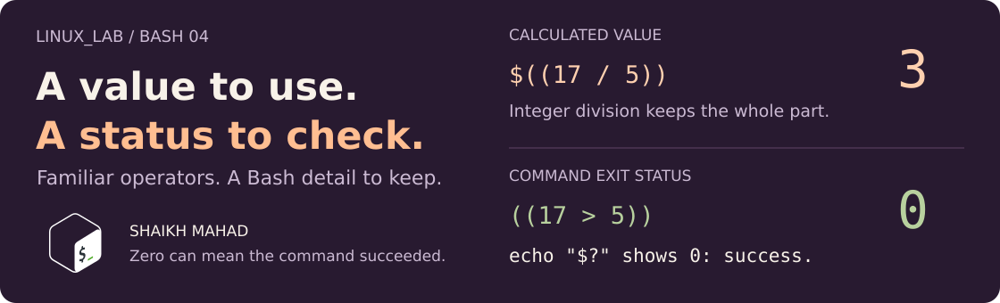

[LINUX_LAB](../../../README.md) / [Bash scripting](../../../README.md#what-im-learning) / **04**

# Operators and Expressions

<picture>
  <source media="(max-width: 620px)" srcset="../../../assets/lessons/bash-operators-and-expressions-mobile.svg">
   5)) succeeds with exit status 0." width="100%">
</picture>

The operators look familiar from C++ and Java. The thing I want to remember is the result: **a calculated value and a command's exit status are different things**. Once that clicks, comparisons and command chaining make a lot more sense.

[Calculate](#arithmetic) · [Exit status](#exit-status) · [Compare](#numbers-and-strings) · [Chain commands](#command-chaining) · [Try it](#your-turn-predict-the-next-command) · [Revision](#quick-revision)

## Open the chapter

From the repo root, in a Bash terminal:

```bash
cd learning/bash-scripting/04-operators-and-expressions
```

Run each file with `bash`, for example `bash arithmetic.sh`. These examples use fixed values and only print output; edit the values to try another case.

| In order | What to watch |
| :--- | :--- |
| [arithmetic.sh](arithmetic.sh) | Calculate with `17` and `5`, then change precedence with parentheses. |
| [assignment-and-update.sh](assignment-and-update.sh) | Follow `count` through `++`, `--`, and compound assignments. |
| [numeric-comparisons.sh](numeric-comparisons.sh) | Compare two numbers and capture each status immediately. |
| [string-comparisons.sh](string-comparisons.sh) | Compare text, test emptiness, and distinguish a literal from a pattern. |
| [logical-expressions.sh](logical-expressions.sh) | Combine tests with AND, OR, and NOT. |
| [command-chaining.sh](command-chaining.sh) | Run or skip the next command based on the previous result. |

## Arithmetic

```bash
first=17
second=5
quotient=$((first / second))
remainder=$((first % second))

echo "Quotient: $quotient, remainder: $remainder"    # Quotient: 3, remainder: 2
```

Bash does **integer arithmetic** here. `17 / 5` is `3`, not `3.4`. Keep the divisor nonzero. Use plain integers in these examples; don't feed arbitrary input straight into an arithmetic expression.

| Familiar operation | Bash form | Result |
| :--- | :--- | :--- |
| Add, subtract, multiply | `$((17 + 5))`, `$((17 - 5))`, `$((17 * 5))` | `22`, `12`, `85` |
| Power | `$((2 ** 8))` | `256` |
| Usual precedence | `$((2 + 3 * 4))` | `14` |
| Group first | `$(((2 + 3) * 4))` | `20` |
| Update an existing value | `((count += 5))`, `((count++))` | Changes `count`; doesn't print it. |

`$((...))` inserts the calculated value into an assignment or command. `((...))` evaluates an expression as a command, which also has a status.

In [assignment-and-update.sh](assignment-and-update.sh), `count++` adds one and `count--` subtracts one. The compound operators `+=`, `-=`, `*=`, `/=`, and `%=` calculate and store the result back in `count`. For example, `((count %= 3))` means `count=$((count % 3))`.

## Exit status

Every command leaves a status in `$?`. **`0` means success; a nonzero status means failure or another unsuccessful outcome.** For comparisons, that means `0` for true and `1` for false.

```bash
((17 > 5))
status=$?
echo "Comparison status: $status"    # 0

((17 < 5))
status=$?
echo "Comparison status: $status"    # 1
```

Save `$?` immediately. An `echo`, another comparison, or even an assignment can replace it.

In the comparison scripts, `status` is just a variable I chose to hold that result. The `->` inside the printed messages is only a label, not a Bash operator.

This is the bit that feels backwards coming from C++: **inside arithmetic, zero is false; outside it, exit status zero signals success.** `((expression))` returns status `0` when its value is nonzero, and status `1` when its value is zero.

<details>
<summary><strong>Why count++ can succeed at updating but still return status 1</strong></summary>

```bash
count=0
((count++))
status=$?
echo "count=$count, status=$status"    # count=1, status=1
```

Post-increment evaluates to the old value, `0`, even though it updates `count` to `1`. The status describes that expression's value. This matters when putting arithmetic before `&&` or using scripts that stop on failures.

</details>

## Numbers and strings

My usual choice in Bash is `((...))` for numbers and `[[ ... ]]` for text or file tests.

| What I'm checking | Example | Status |
| :--- | :--- | :--- |
| Numeric comparison | `((17 >= 5))` | `0` |
| Equal text | `[[ "$role" == "student" ]]` | `0` if `role` is `student` |
| Different text | `[[ "$role" != "admin" ]]` | `0` if `role` isn't `admin` |
| Nonempty string | `[[ -n "$name" ]]` | `0` if `name` has any characters |
| Empty string | `[[ -z "$note" ]]` | `0` if `note` is empty |

Numbers support `==`, `!=`, `<`, `<=`, `>`, and `>=` inside `((...))`. Inside `[[ ... ]]`, `<` and `>` compare **text order**, so use arithmetic when you mean numeric order.

Quotes also matter on the right side of `==`:

```bash
filename="notes.sh"
[[ "$filename" == "*.sh" ]]    # Status 1: looks for the literal text *.sh.
[[ "$filename" == *.sh ]]      # Status 0: matches the pattern.
```

That pattern test matches the string; it doesn't search the directory for files. The [quoting chapter](../02-variables-and-expansion/README.md#the-quotes-change-the-command) explains word splitting in ordinary commands. `[[ ... ]]` doesn't do that splitting, but quoting a comparison value is still how I ask for literal text.

<details>
<summary><strong>What about the single brackets in other scripts?</strong></summary>

`[ ... ]` is the older `test` command form, also used by POSIX shells:

```bash
first=17
second=5
[ "$first" -gt "$second" ]
echo "$?"    # 0
```

Its numeric operators are `-eq`, `-ne`, `-lt`, `-le`, `-gt`, and `-ge`. Quote variables and keep spaces around the arguments and closing `]`. Use `=` for portable string equality.

`[ ... ]`, `[[ ... ]]`, and `((...))` aren't interchangeable punctuation. These scripts run with Bash, so I use its double-bracket and arithmetic forms.

</details>

## Logical expressions

```bash
role="student"
active="no"

[[ "$role" == "student" && "$active" == "yes" ]]    # 1: both must be true.
[[ "$role" == "admin" || "$role" == "student" ]]    # 0: either can be true.
[[ ! "$role" == "admin" ]]                         # 0: reverses the test.
```

`&&` and `||` short-circuit: Bash skips the right side when the left side already settles the result. Run [logical-expressions.sh](logical-expressions.sh) to see each status, then change `active` to `yes` and predict which one changes.

## Command chaining

The same `&&` and `||` symbols can connect complete commands:

```bash
true && echo "This runs after success."
false || echo "This runs after failure."
false && echo "This line is skipped."
```

`true` and `false` are commands that return `0` and `1` without printing anything. They make it easy to see which side runs without creating files or relying on a path being missing.

| Join | When the next command runs |
| :--- | :--- |
| `command1 && command2` | Only if `command1` returns `0`. |
| `command1 \|\| command2` | Only if `command1` returns nonzero. |
| `command1; command2` | After the first finishes, regardless of its status in these examples. |

The `read ... || exit 1` in [chapter 03's input.sh](../03-input-and-output/input.sh) uses this rule: if reading fails, end the script with status `1`.

One trap: `a && b || c` isn't a guaranteed replacement for `if/else`. `c` also runs if `a` succeeds but `b` fails. Command lists evaluate these joins from left to right; unlike arithmetic expressions, `&&` and `||` have equal precedence here.

## Your turn: predict the next command

```bash
sessions=3
((sessions += 1))
((sessions >= 4)) && echo "Four sessions in."
((sessions < 4)) || echo "Time to revise."
```

Which messages print? Try again with `sessions=1`.

<details>
<summary><strong>Check your prediction</strong></summary>

Starting at `3`, the update gives `4` and both messages print. Starting at `1`, the update gives `2` and neither prints: `&&` skips its message after a false test, while `||` skips its message after a true test.

Now try `true && false || echo "Fallback ran."`. The fallback still runs, even though the first command succeeded.

</details>

## Quick revision

| If I forget… | The reminder I need |
| :--- | :--- |
| Value or status? | `$((...))` gives a value. `$?` gives the previous command's status. |
| Why a true comparison shows `0` | Zero is the successful exit status, not the arithmetic truth value. |
| Why a test shows no output | It sets a status. Capture and print it to see it. |
| Why a fallback ran | Check the status of the command immediately before `\|\|`. |

<details>
<summary><strong>References for the details</strong></summary>

GNU Bash manual: [shell arithmetic](https://www.gnu.org/software/bash/manual/html_node/Shell-Arithmetic.html), [conditional constructs](https://www.gnu.org/software/bash/manual/html_node/Conditional-Constructs.html), [exit status](https://www.gnu.org/software/bash/manual/html_node/Exit-Status.html), and [command lists](https://www.gnu.org/software/bash/manual/html_node/Lists.html). Offline: `help '(('`, `help '[['`, and `man bash`.

</details>

[← Bash 03: Input and Output](../03-input-and-output/README.md) · [Back to the learning map](../../../README.md#what-im-learning)

**This is where my Bash notes have reached so far.** Next I want to use these tests in `if/else` and loops. I'll add those chapters as I study them.
