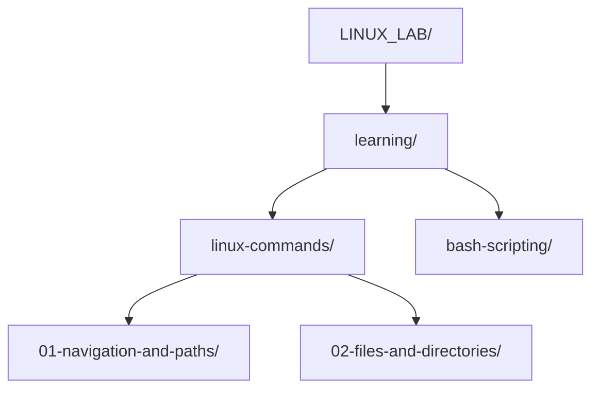

[LINUX_LAB](../../../README.md) / [Linux commands](../../../README.md#what-im-learning) / **01**


# Navigation and Paths

**Know where you are before you start changing things.**

A terminal doesn't give you a row of open folders to click through. You ask where you are, look around, and choose where to go. These are the three commands I want within easy reach before getting into the rest of Linux.

| Where am I? | What's here? | How do I get there? |
| :--- | :--- | :--- |
| `pwd` prints your location. | `ls` lists files and directories. | `cd` changes your location. |

<br clear="right">

[Try it](#start-in-your-copy-of-the-repo) · [Read a command](#read-a-command) · [Understand paths](#give-a-command-an-address) · [Practise](#take-a-short-trip-through-the-repo) · [Quick revision](#quick-revision)

> **By the end:** find a folder, explain the path you used, and get back without guessing.
>
> **Before starting:** open a Bash terminal on Linux or Ubuntu in WSL. The main README has [setup instructions](../../../README.md#get-a-linux-terminal) and [clone instructions](../../../README.md#lets-run-something).

## Start in your copy of the repo

Open your cloned `LINUX_LAB` folder in your editor, then open a terminal there. If you're already using a separate terminal, use `cd` followed by the location where **you** saved the repo.

Run:

```bash
pwd
ls -1 learning
```

`pwd` means *print working directory*. It prints the path to the directory your shell is currently working in. Here, that path should end in `/LINUX_LAB`. The part before it depends on where you cloned the repo.

The second command lists the contents of `learning`, one entry per line:

```text
bash-scripting
linux-commands
```

That is the digit **1** in `ls -1`, not a lowercase L.

Now take one step in and one step back:

```bash
cd learning
pwd
cd ..
pwd
```

| After this command | Your location should end in |
| :--- | :--- |
| `cd learning` | `/LINUX_LAB/learning` |
| `cd ..` | `/LINUX_LAB` |

A successful `cd` normally prints nothing. Use `pwd` to see the change. `cd ..` moves to the **parent directory**, the folder containing the one you're in.

**Keep this terminal open.** You're back at the repo root, which is the starting point for the next examples.

## Read a command

A useful pattern for many commands is:

```text
command [options] [arguments]
```

The square brackets here mean “optional.” Don't type those brackets.

For example, from the repo root:

```bash
ls -la learning
```

| Part | What it does |
| :--- | :--- |
| `ls` | The command to run. |
| `-l` | Ask for a detailed listing. This is a lowercase L. |
| `-a` | Include entries whose names start with a dot. |
| `learning` | The directory to inspect. This is an argument. |

For these `ls` options, `-la` combines `-l -a`. Options change the behaviour of a command; arguments tell it what to work on. Each command defines the options it accepts.

A command such as `ls learning` can inspect another directory **without moving you into it**. Run `pwd` afterwards: you're still at the repo root.

## Look around with ls

Start with the plain command:

```bash
ls
```

With no path argument, it lists the current directory. These are the options worth practising first:

| Command | What changes |
| :--- | :--- |
| `ls` | List visible entries in the current directory. |
| `ls -1` | Put each entry on its own line. |
| `ls -a` | Include hidden entries, plus `.` and `..`. |
| `ls -A` | Include hidden entries, but leave out `.` and `..`. |
| `ls -l` | Show details such as permissions, owner, size, and modification time. |
| `ls -lah` | Combine a detailed listing, hidden entries, and readable sizes such as `4.0K`. |

Try `ls -a` in the repo root. You should see `.git` and `.gitignore` among the entries.

A name beginning with a dot is hidden from ordinary listings. “Hidden” doesn't mean protected or encrypted. `.` and `..` are special entries for the current and parent directories.

<details>
<summary><strong>Read one line of ls -l output</strong></summary>

Inspect a file that is already in this repo:

```bash
ls -l README.md
```

An illustrative line looks like this; the values on your machine will differ:

```text
-rw-r--r-- 1 student student 4096 Sep 7 10:00 README.md
```

| Part | Meaning |
| :--- | :--- |
| `-` at the beginning | This is a regular file. A directory begins with `d`. |
| `rw-r--r--` | Permission bits. We'll study these in the permissions topic later. |
| `1` | Number of hard links. |
| First `student` | Owner. |
| Second `student` | Group. |
| `4096` | File size in bytes in this example. `-h` changes how sizes are displayed. |
| `Sep 7 10:00` | Modification time, in this example's display format. |
| `README.md` | The filename. |

For now, recognise the columns. You don't need to learn permissions and hard links just to move between folders. File metadata gets more attention in [Files and Directories](../02-files-and-directories/README.md).

Terminal colours depend on your settings. Use the listing's information rather than relying on a particular colour to identify a directory.

</details>

## Give a command an address

A **path** tells a command where to find something. The same path can be given to `cd`, `ls`, or another command that accepts filenames.

### Absolute paths start at /

`/` is the root of the Linux filesystem. An absolute path starts there, so it doesn't depend on your current working directory.

```bash
ls /home
```

This inspects `/home` even when you're inside the repo. On a typical Ubuntu setup, user home directories live there.

To get an absolute path to **your** repo, run `pwd` while you're at its root. You can later pass that full path to `cd`. Don't copy someone else's `/home/username/...` path and expect it to exist on your computer.

### Relative paths start where you are

From the repo root:

```bash
ls learning/linux-commands
```

This starts from the current directory, then looks inside `learning`, then `linux-commands`.

If you're already inside `learning`, the relative path becomes simply:

```bash
ls linux-commands
```

These commands reach the same directory from different starting points.

<details>
<summary><strong>Open a map of the folders used in this chapter</strong></summary>

This is just the relevant part of the repo:



From `01-navigation-and-paths`, one `..` gets you to `linux-commands`, two get you to `learning`, and three get you to `LINUX_LAB`.

</details>

### The small symbols you'll keep seeing

| Path or command | Meaning |
| :--- | :--- |
| `/` | The filesystem root. |
| `~` | Your home directory, when Bash expands the unquoted tilde. |
| `.` | The current directory. |
| `..` | The parent directory. |
| `../..` | Two parent directories up. |
| `cd` or `cd ~` | Go to your home directory. |
| `cd -` | Go to the previous working directory and print its path. |

The **repo root** means the top-level `LINUX_LAB` directory. The **filesystem root** means `/`. Your **home directory** is your account's own starting place. They're three different things.

`cd -` is different from `cd ..`. The first returns to the last directory you were in; the second goes to the parent. Before you've changed directories, `cd -` may report that `OLDPWD` isn't set.

## Names need a little care

### Uppercase and lowercase can matter

Ubuntu's usual Linux filesystems distinguish `learning` from `Learning`. Use the spelling that `ls` shows. Mounted Windows drives in WSL can have different case behaviour.

Tab completion is a good way to avoid guessing the spelling.

### Keep a path with spaces together

If a directory is named `OS Lab`, pass that name as one argument:

```bash
cd "OS Lab"
```

That is a naming example, not a folder supplied with this repo. Without the quotes, Bash passes `OS` and `Lab` separately, and `cd` normally complains about too many arguments.

One detail to remember: quoting `"~"` stops Bash from expanding it to your home directory. Use `cd ~` or just `cd` to go home. We'll cover quoting properly in [Variables and Expansion](../../bash-scripting/02-variables-and-expansion/README.md).

## Let the keyboard help

In Bash, start typing this from the repo root:

```text
cd lea
```

Press <kbd>Tab</kbd>. If there is one match, Bash completes the name. If there are several, another <kbd>Tab</kbd> can show the possibilities. Completion settings can change the exact behaviour.

<details>
<summary><strong>A few shortcuts to keep beside the terminal</strong></summary>

These are common defaults for an interactive Bash terminal.

| Keys | What they do |
| :--- | :--- |
| <kbd>↑</kbd> / <kbd>↓</kbd> | Browse previous commands. |
| <kbd>Ctrl</kbd> + <kbd>R</kbd> | Search backwards through command history. |
| <kbd>Ctrl</kbd> + <kbd>A</kbd> | Move to the beginning of the line. |
| <kbd>Ctrl</kbd> + <kbd>E</kbd> | Move to the end of the line. |
| <kbd>Ctrl</kbd> + <kbd>L</kbd> | Clear the visible screen; this doesn't erase command history. |
| <kbd>Ctrl</kbd> + <kbd>C</kbd> | Cancel the input line, or ask a foreground program to stop. Some programs handle it differently. |

For history search, press <kbd>Ctrl</kbd> + <kbd>R</kbd> and type part of an earlier command, such as `ls`. Check the result before pressing Enter. <kbd>Ctrl</kbd> + <kbd>C</kbd> cancels the search.

</details>

## Take a short trip through the repo

**Start at the repo root.** This exercise uses folders and files already in the clone. Type one command at a time and check where each step leaves you.

1. Enter `learning/linux-commands/01-navigation-and-paths`.
2. List the files there, including hidden entries.
3. Move directly to the neighbouring `02-files-and-directories` folder using a relative path.
4. Use `cd -` to return to this chapter.
5. Return to the repo root using parent-directory notation.
6. List `learning/bash-scripting` without leaving the repo root. Use `pwd` to confirm.

<details>
<summary><strong>Compare your route with mine</strong></summary>

Run this whole sequence from the repo root:

```bash
cd learning/linux-commands/01-navigation-and-paths
pwd
ls -a
cd ../02-files-and-directories
pwd
cd -
pwd
cd ../../..
pwd
ls learning/bash-scripting
pwd
```

| Checkpoint | The end of your working-directory path |
| :--- | :--- |
| After entering this chapter | `/LINUX_LAB/learning/linux-commands/01-navigation-and-paths` |
| After entering the neighbouring chapter | `/LINUX_LAB/learning/linux-commands/02-files-and-directories` |
| After `cd -` | `/LINUX_LAB/learning/linux-commands/01-navigation-and-paths` |
| After `cd ../../..` | `/LINUX_LAB` |
| After the final `ls` | Still `/LINUX_LAB`. Listing a directory doesn't move you. |

The beginning of the path and the exact listings can differ between clones. The route should be the same.

</details>

<details>
<summary><strong>One more check: can you spot the wrong path?</strong></summary>

You're inside `LINUX_LAB/learning`. Which command lists the Linux command chapters?

1. `ls linux-commands`
2. `ls learning/linux-commands`

**Answer: 1.** The second path would look for another `learning` directory inside the one you're already in.

This is why `pwd` is useful when a command says a file or directory doesn't exist.

</details>

## When a path doesn't work

| What you see | What to check |
| :--- | :--- |
| `No such file or directory` | Run `pwd` and `ls`. Check your starting point, spelling, and letter case. |
| `Not a directory` | You may have passed a file to `cd`, such as `README.md`. `cd` enters directories. |
| `too many arguments` | A path with spaces may need quotes. |
| `Permission denied` | Your account may lack permission to enter part of the path. Practise in your own repo; changing permissions is a later topic. |

A failed `cd` leaves you in the same directory. Check with `pwd` before continuing.

If you need to check the command itself, Bash has local help:

```bash
help cd
help pwd
ls --help
```

`cd` and Bash's `pwd` are shell builtins, so `help` describes them. `ls --help` describes the installed `ls` program. You can look things up without leaving the terminal.

## Quick revision

| I want to… | Command |
| :--- | :--- |
| Check my location | `pwd` |
| See what's here | `ls` |
| See hidden entries | `ls -a` |
| Read a detailed listing with friendly sizes | `ls -lah` |
| Inspect another folder without moving | `ls path/to/directory` |
| Enter a folder | `cd path/to/directory` |
| Go up one level | `cd ..` |
| Go home | `cd` |
| Return to the previous location | `cd -` |

The paths in this table are placeholders. Replace them with the directory you actually want.

**Before moving on, try explaining these without looking up:** why `ls learning` doesn't change your location, how `/` differs from `~`, and when you'd choose `cd -` instead of `cd ..`.

<details>
<summary><strong>References behind these notes</strong></summary>

- [Bash builtin commands](https://www.gnu.org/software/bash/manual/html_node/Bourne-Shell-Builtins.html): `cd` and `pwd`.
- [Which files ls lists](https://www.gnu.org/software/coreutils/manual/html_node/Which-files-are-listed.html): visible and hidden entries.
- [Bash tilde expansion](https://www.gnu.org/software/bash/manual/html_node/Tilde-Expansion.html): what `~` means and why quoting matters.
- Local references: `help cd`, `help pwd`, and `ls --help`.
- [Artwork credits](../../../assets/README.md#tux) for the Tux image.

</details>

## Next, make something

Now that you can find a directory and get back, the next chapter uses `mkdir` and `touch` to create a small workspace of your own.

**[Continue to 02: Files and Directories](../02-files-and-directories/README.md)**

[Back to LINUX_LAB](../../../README.md) · [All learning topics](../../../README.md#what-im-learning) · [Back to the top](#navigation-and-paths)

Notes by **Shaikh Mahad**. If an example behaves differently in your terminal, [tell me what happened](https://github.com/codewithmahad/LINUX_LAB/issues).
