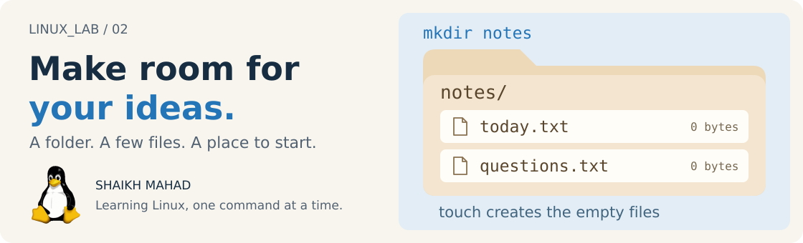

[LINUX_LAB](../../../README.md) / [Linux commands](../../../README.md#what-im-learning) / **02**

# Files and Directories

<picture>
  <source media="(max-width: 620px)" srcset="../../../assets/lessons/files-and-directories-mobile.svg">
  
</picture>

In the [first chapter](../01-navigation-and-paths/README.md), we moved through folders that already existed. Now let's make a small workspace of our own and look at what Linux knows about each file.

I like having a separate place for these experiments. It makes it easier to try a command, check the result, and leave my actual notes alone.

[Set up](#a-place-to-practise) · [Create folders](#make-the-folders) · [Create files](#give-the-folders-some-files) · [Inspect](#look-beyond-the-filename) · [Practise](#your-turn-build-a-tiny-project) · [Revise](#quick-revision)

> **By the end:** build a directory structure, create empty files, and explain the difference between a file's contents and its metadata.
>
> **Before starting:** use a Bash terminal on Linux or Ubuntu in WSL. You should be comfortable with `pwd`, `ls`, and `cd` from [Navigation and Paths](../01-navigation-and-paths/README.md).

## A place to practise

Create a practice folder in your home directory, outside the cloned repo:

```bash
mkdir -p ~/linux-lab-practice/files
cd ~/linux-lab-practice/files
pwd
```

Your path should end in `/linux-lab-practice/files`. Stay here for the chapter's examples.

`mkdir` means *make directory*. We used `-p` so it can create the missing parent folders too. It also accepts a directory that already exists, which makes this setup easy to run again.

The listings below assume a fresh practice folder. If you've been here before, you'll also see anything you kept from the last visit.

## Make the folders

Create two neighbouring directories with one command:

```bash
mkdir notes scripts
ls
```

You should see `notes` and `scripts`. Each name is a separate argument to `mkdir`.

Now create a deeper path:

```bash
mkdir -pv projects/web/assets
```

| Option | What it adds |
| :--- | :--- |
| `-p` | Create missing parents and accept directories that already exist. |
| `-v` | Print a message for each directory created. |

Here, `-pv` combines the two options. On the first run, you'll get creation messages for `projects`, `projects/web`, and `projects/web/assets`. Run it again: those directories already exist, so there is nothing new to report.

**A useful distinction:** `mkdir notes` reports `File exists` if `notes` already exists. `mkdir -p notes` accepts an existing directory, but it still fails if `notes` is a regular file. A file and a directory cannot share the same name in the same parent.

<details>
<summary><strong>What happens without -p?</strong></summary>

Suppose neither `drafts` nor `drafts/week-01` exists. Running:

```bash
mkdir drafts/week-01
```

fails because the parent `drafts` is missing. `mkdir` without `-p` creates the final directory, not the missing parents.

To create the whole path:

```bash
mkdir -p drafts/week-01
```

This optional example adds a `drafts` folder to your workspace.

</details>

## Give the folders some files

Create three empty files:

```bash
touch notes/today.txt notes/questions.txt scripts/hello.sh
ls -l notes/today.txt
```

For a newly created `today.txt`, the size column is **0 bytes**. The filename exists, but we haven't written anything inside it yet.

`touch` can take several filenames, just like `mkdir` can take several directory names. It doesn't create missing parent directories, so we made `notes` and `scripts` first.

### Touching a file doesn't empty it

The main job of `touch` is to update **access and modification timestamps**. Creating an empty file is what it does when the named file doesn't exist.

| Before `touch notes/today.txt` | What happens |
| :--- | :--- |
| The file doesn't exist, but `notes` does. | An empty file is created. |
| The file already exists. | Its timestamps are updated; its contents are preserved. |
| The parent `notes` doesn't exist. | The command fails. |

So `touch` is useful for preparing a project, but it isn't a text editor. Naming an empty file `hello.sh` doesn't put a Bash program in it either.

<details>
<summary><strong>Other touch options, when you need them</strong></summary>

| Command | Effect |
| :--- | :--- |
| `touch -a notes/today.txt` | Update access time, leaving modification time alone. |
| `touch -m notes/today.txt` | Update modification time, leaving access time alone. |
| `touch -c notes/not-created.txt` | Update the file if it exists; don't create it if it doesn't. |

The filesystem's **change time** can still update with `-a` or `-m`. These flags select which of the access and modification times to set.

For a deliberate timestamp experiment:

```bash
touch -m -t 202401020930 notes/today.txt
stat notes/today.txt
```

This sets modification time to **2 January 2024 at 09:30**, using your current timezone. The form used here is `YYYYMMDDhhmm`: year, month, day, hour, minute.

Bring access and modification times back to the current time afterwards:

```bash
touch notes/today.txt
```

You don't need to memorise the timestamp format for ordinary file creation.

</details>

## Look beyond the filename

Two questions call for two different commands:

| What am I trying to find out? | Use |
| :--- | :--- |
| What kind of thing is this? | `file` |
| What information does the filesystem keep about it? | `stat` |

### File: what is it?

```bash
file notes/today.txt notes scripts/hello.sh
```

On a fresh workspace, `file` reports:

| Path | Result |
| :--- | :--- |
| `notes/today.txt` | `empty` |
| `notes` | `directory` |
| `scripts/hello.sh` | `empty` |

That last result is worth checking. Even with a `.sh` extension, the file is empty. `file` uses filesystem information and tests of the contents to identify data; the extension alone isn't proof of its type.

Extensions still help people and applications choose how to handle a file. They just don't guarantee what's inside.

### Stat: what does Linux know about it?

```bash
stat notes/today.txt
```

You'll get the file's size, type, permissions, owner, group, timestamps, and other metadata. The values belong to **your** file and system, so there's no need to match someone else's inode number or username.

Start with these fields:

| Field | What to look for |
| :--- | :--- |
| `Size` | `0` for the empty file we just made. |
| File type | A regular empty file, rather than a directory. |
| `Uid` / `Gid` | The owner and group. Usually your own account and group in this workspace. |
| `Access`, `Modify`, `Change`, `Birth` | Different timestamps, explained below. |

`stat` usually has **two lines labelled Access**. One shows permissions, such as `0644/-rw-r--r--`. The other shows the access timestamp. Read the value beside the label.

### Four timestamps, different questions

| Timestamp | The question it answers |
| :--- | :--- |
| **Access** (`atime`) | When was the file's data last accessed, as recorded by the filesystem? |
| **Modify** (`mtime`) | When were the contents last modified? This can also be set by `touch`. |
| **Change** (`ctime`) | When did the file's status last change, for example its permissions, timestamps, or contents? |
| **Birth** | When was the file created, if the system exposes that information? |

**The `c` in `ctime` is change, not creation.** Birth time is separate and may appear as `-` when unavailable. Access-time updates also depend on filesystem and mount settings, so reading a file won't always produce a new access timestamp immediately.

Try this pair, then compare the timestamps:

```bash
touch notes/today.txt
stat notes/today.txt
```

The file stays empty. Its access and modification times are set to now, and its change time will normally update too. This is why a timestamp alone doesn't prove that someone edited the contents.

<details>
<summary><strong>What about blocks, inodes, and links?</strong></summary>

`Size` counts the file's bytes; `Blocks` describes allocated storage. These aren't the same measurement. An inode identifies a filesystem object within its filesystem, and `Links` counts hard links to it.

We'll return to storage and links when studying the filesystem in more depth. For this chapter, use `ls -l` for a quick listing and `stat` when you need a closer look.

</details>

## See the shape with tree

```bash
tree -L 3 .
```

`tree` draws a directory listing. `-L 3` limits how many levels it explores; `.` starts at the current directory.

If you followed the main examples in a fresh workspace, the listing looks like this, before `tree`'s summary line:

```text
.
├── notes
│   ├── questions.txt
│   └── today.txt
├── projects
│   └── web
│       └── assets
└── scripts
    └── hello.sh
```

I find this much easier to check than opening each folder separately. It also makes a useful little map to include when asking someone for help with a project.

| Command | View |
| :--- | :--- |
| `tree -L 3 .` | Files and directories, up to three levels deep. |
| `tree -d -L 3 .` | Only directories, with the same depth limit. |
| `tree -a -L 3 .` | Include hidden entries too. |
| `tree notes` | Start at `notes` instead of the current directory. |

<details>
<summary><strong>If tree or file isn't installed</strong></summary>

On Ubuntu, including Ubuntu in WSL:

```bash
sudo apt update
sudo apt install tree file
```

`sudo` requests administrator privileges. `apt update` refreshes package information; `apt install` installs the named packages. These commands need a network connection and permission to install software. Other distributions use their own package managers.

On a university machine where you can't install packages, keep going with `ls -R .` for a recursive listing. The layout differs from `tree`, but you can still check the folders. Skip the `file` examples until it is available.

</details>

## Your turn: build a tiny project

**Start in `~/linux-lab-practice/files`.** Create a new folder called `mini-project` containing:

| Directory | Empty files inside it |
| :--- | :--- |
| `mini-project/src` | `main.sh` |
| `mini-project/docs` | `notes.txt`, `questions.txt` |

Then:

1. Show the project's structure.
2. Ask `file` what `main.sh` contains.
3. Use `stat` to check its size.
4. Run the directory-creation command again with `-p`. Does anything get replaced?

<details>
<summary><strong>Compare with my commands</strong></summary>

```bash
mkdir -p mini-project/src mini-project/docs
touch mini-project/src/main.sh mini-project/docs/notes.txt mini-project/docs/questions.txt
tree mini-project
file mini-project/src/main.sh
stat mini-project/src/main.sh
mkdir -p mini-project/src mini-project/docs
```

You should have **two directories inside `mini-project` and three files**. On the first run, `main.sh` is empty and has a size of 0 bytes. Running `mkdir -p` again keeps the existing directories and their contents.

If `file` calls `main.sh` empty, that's correct. We made a filename for a script; writing the script comes later.

</details>

## When something doesn't work

| What you see | What to check |
| :--- | :--- |
| `mkdir: ... File exists` | Inspect the name with `ls -ld`. If it is already a directory, reuse it or use `mkdir -p`. |
| `touch: ... No such file or directory` | Check that the parent folder exists. Create it with `mkdir -p` first. |
| `Not a directory` | Part of the path may be a regular file. Check each component. |
| `Permission denied` | Check `pwd`. The exercises belong in your home workspace, where you can create files. |
| `command not found` | Check the spelling, then the optional installation note above. |

For a name containing spaces, remember the [quoting example](../01-navigation-and-paths/README.md#keep-a-path-with-spaces-together): `mkdir "OS Lab"` passes one directory name.

## Quick revision

| I want to… | Command pattern |
| :--- | :--- |
| Create a directory | `mkdir directory` |
| Create a nested path | `mkdir -p parent/child` |
| See what was created | `mkdir -pv parent/child` |
| Create an empty file, or update its timestamps | `touch filename` |
| Avoid creating a missing file | `touch -c filename` |
| Identify data | `file filename` |
| Inspect metadata | `stat filename` |
| See a directory layout | `tree -L 3 directory` |

The names in this table are placeholders. Use your own paths.

**Before moving on:** explain why `touch` doesn't erase an existing file, why `.sh` doesn't make a file a script, and why change time isn't creation time.

<details>
<summary><strong>References behind these notes</strong></summary>

- GNU Coreutils: [mkdir](https://www.gnu.org/software/coreutils/manual/html_node/mkdir-invocation.html), [touch](https://www.gnu.org/software/coreutils/manual/html_node/touch-invocation.html), [stat](https://www.gnu.org/software/coreutils/manual/html_node/stat-invocation.html), and [file timestamps](https://www.gnu.org/software/coreutils/manual/html_node/File-timestamps.html).
- Local manuals: `man file`, `man tree`, and each command's `--help` output.
- [Chapter artwork and credits](../../../assets/README.md#lesson-covers).

</details>

## We've made files. Let's read some.

Keep your practice folder for later. In the next chapter, we'll use small text files included in the repo to try `cat`, `head`, `tail`, and `less`. There will actually be something inside them this time.

**[Continue to 03: Viewing File Content](../03-viewing-file-content/README.md)**

[Previous: Navigation and Paths](../01-navigation-and-paths/README.md) · [All learning topics](../../../README.md#what-im-learning) · [Back to the top](#files-and-directories)

Notes by **Shaikh Mahad**. Found a mistake or a clearer example? [Tell me what you tried](https://github.com/codewithmahad/LINUX_LAB/issues). I'm learning this too.
