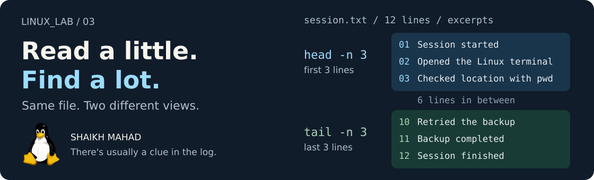

[LINUX_LAB](../../../README.md) / [Linux commands](../../../README.md#what-im-learning) / **03**

# Viewing File Content

<picture>
  <source media="(max-width: 620px)" srcset="../../../assets/lessons/viewing-file-content-mobile.svg">
  
</picture>

An empty file was enough for practising `touch`. It isn't very interesting to read. I've included two small text files here so we can run the same commands and compare what comes out.

The useful question isn't just “how do I open this?” Sometimes I want the whole file, sometimes only its last few lines, and sometimes I want to sit and search through it.

[Start here](#open-the-example-folder) · [Choose a command](#how-much-do-you-want-to-read) · [Browse with less](#less-take-your-time-and-look-around) · [Watch a log](#watch-a-file-grow) · [Practise](#your-turn-investigate-the-session) · [Revise](#quick-revision)

> **By the end:** choose a viewer, find a line in a file, and watch new text arrive in a second terminal.
>
> **Before starting:** use Bash on Linux or Ubuntu in WSL. [Files and Directories](../02-files-and-directories/README.md) covers file creation and inspection. The reading examples here don't require its practice folder.

## Open the example folder

Start at the root of your cloned `LINUX_LAB` repo, then run:

```bash
cd learning/linux-commands/03-viewing-file-content
pwd
ls examples
```

Stay in this chapter folder for the reading examples. The two supplied files are:

| File | What's inside |
| :--- | :--- |
| [examples/topics.txt](examples/topics.txt) | Three topics, one per line. |
| [examples/session.txt](examples/session.txt) | A made-up 12-line session log with `INFO`, `WARN`, and `ERROR` entries. |

The session file is a teaching example, not output captured from a real system. Its `.txt` extension makes it easy to open anywhere; this example has the same plain-text format as many application logs.

## How much do you want to read?

| The whole short file | A small part | A file to explore |
| :--- | :--- | :--- |
| **`cat`** prints the contents. | **`head`** starts at the top. | **`less`** lets you scroll and search. |
| Add **`-n`** for line numbers. | **`tail`** takes the end. | Press **`q`** when you're done. |

These commands read files. The line numbers and selections they show don't rewrite the source file.

## Cat: read the whole thing

```bash
cat examples/topics.txt
```

Output:

```text
Linux commands
Bash scripting
Operating systems
```

`cat` means *concatenate*. Give it more than one file and it prints their contents in the order you supplied:

```bash
cat examples/topics.txt examples/session.txt
```

You'll see the three topic lines followed by the twelve session lines. It doesn't add filenames or a separator between them, and it doesn't save a combined file.

### Put a number beside each line

```bash
cat -n examples/topics.txt
```

Output, with spacing that may look slightly different in your terminal:

```text
     1  Linux commands
     2  Bash scripting
     3  Operating systems
```

`-n` numbers all output lines, including blank ones. It's handy when sharing “look at line 8” with someone. The numbers belong to the displayed output, not to `topics.txt`.

For a long file, I reach for `less` instead of sending everything past the screen at once.

## Head and tail: take a smaller look

Both commands show **10 lines by default**, or the whole file if it has fewer than ten. Use `-n` followed by a number to choose how many lines you want.

### The first three lines

```bash
head -n 3 examples/session.txt
```

```text
09:00 INFO  Session started
09:01 INFO  Opened the Linux terminal
09:02 INFO  Checked location with pwd
```

### The last three lines

```bash
tail -n 3 examples/session.txt
```

```text
09:09 INFO  Retried the backup
09:10 INFO  Backup completed
09:11 INFO  Session finished
```

The chapter cover shows these two selections on the same file. `head` starts from the beginning; `tail` takes the end. Neither changes your place in the file for the next command.

**Notice the option's context:** `cat -n` turns on numbering, while `head -n 3` and `tail -n 3` choose a line count. An option's meaning belongs to its command.

<details>
<summary><strong>What if I give head more than one file?</strong></summary>

```bash
head -n 2 examples/topics.txt examples/session.txt
```

For multiple files, `head` labels each section:

```text
==> examples/topics.txt <==
Linux commands
Bash scripting

==> examples/session.txt <==
09:00 INFO  Session started
09:01 INFO  Opened the Linux terminal
```

`tail` also adds these headings when given multiple files. `cat` doesn't.

</details>

<details>
<summary><strong>Read from a particular line to the end</strong></summary>

The sample's error is on line 8. To read from there onwards:

```bash
tail -n +8 examples/session.txt
```

```text
09:07 ERROR Backup folder is missing
09:08 INFO  Created the backup folder
09:09 INFO  Retried the backup
09:10 INFO  Backup completed
09:11 INFO  Session finished
```

The plus sign changes the question. `tail -n 8` takes the **last eight lines**; `tail -n +8` starts at **line eight** and continues to the end. Line numbering starts at 1.

</details>

## Less: take your time and look around

```bash
less examples/session.txt
```

`less` is a **pager**, a program for browsing text a screen at a time. Our sample is deliberately short, so it may fit on one screen. The same controls work on a much larger log.

Try a search before leaving:

1. Press <kbd>g</kbd> to go to the beginning.
2. Type `/ERROR` and press <kbd>Enter</kbd>.
3. Read the matching line: the backup folder is missing.
4. Press <kbd>q</kbd> to return to your shell.

Use uppercase `ERROR` to match the sample. Search behaviour can depend on options; the default search distinguishes letter case.

| Key | What it does in less |
| :--- | :--- |
| <kbd>↑</kbd> / <kbd>↓</kbd> | Move a line at a time. |
| <kbd>Space</kbd> / <kbd>b</kbd> | Move a screen forward / backward. |
| <kbd>g</kbd> / <kbd>G</kbd> | Go to the beginning / end. |
| `/text`, then <kbd>Enter</kbd> | Search forward for a pattern. |
| <kbd>n</kbd> / <kbd>N</kbd> | Repeat the search in the same / opposite direction. |
| <kbd>h</kbd> | Open the built-in help. |
| <kbd>q</kbd> | Quit the viewer. |

For another search, return to the top with `g`, search for `/INFO`, and press `n` a few times. There are several matches this time. `less` searches patterns, so symbols such as `.` can have special meanings; plain words are enough for this exercise.

Here we're searching while browsing. [Searching and Finding](../05-searching-and-finding/README.md#grep-find-the-lines-that-matter) later uses `grep` to print just the matching lines, including matches across several files.

<details>
<summary><strong>Try it on a longer file, with line numbers</strong></summary>

From this chapter folder, open the repo's main README:

```bash
less -N ../../../README.md
```

Capital `-N` shows line numbers in `less`. You'll see the Markdown source, including its links and image tags. A terminal pager doesn't render it like GitHub does.

Use Space and `b` to move, then `q` to leave. The same exit key is useful when commands such as `git log` open their output in `less`.

</details>

### Where does more fit?

```bash
more ../../../README.md
```

`more` is another pager you may encounter. Space moves a screen forward, Enter moves a line, and `q` quits. Features vary between versions; it is still worth recognising even if you use `less` for these notes.

And yes, someone named the more flexible pager `less`. Linux has its moments.

<picture>
  <source media="(prefers-color-scheme: dark)" srcset="../../../assets/logos/bash-dark.svg">
  
</picture>

## Watch a file grow

Reading a saved log tells you what happened. Following a log lets you see what arrives next. Let's try that with **two terminals** and a file in your own practice folder.

<br clear="right">

### Terminal A: start watching

Run these commands from any directory:

```bash
mkdir -p ~/linux-lab-practice/reading
touch ~/linux-lab-practice/reading/live.log
tail -n 0 -f ~/linux-lab-practice/reading/live.log
```

`-n 0` skips existing lines. `-f` keeps watching for appended data, so an empty screen here is expected. Leave this terminal running.

### Terminal B: add something to read

Open a second Bash terminal in the **same Linux environment and user account**, then run:

```bash
printf '%s\n' 'INFO  The second terminal says hello.' >> ~/linux-lab-practice/reading/live.log
printf '%s\n' 'INFO  I can see the new lines now.' >> ~/linux-lab-practice/reading/live.log
```

`printf` prints each message with a newline. Here, `>>` sends that output to the end of the file, keeping any existing text. We only need this small bit of writing to give the watcher something to display. [Bash Input and Output](../../bash-scripting/03-input-and-output/README.md) has more `printf` examples.

Switch back to Terminal A. You should see:

```text
INFO  The second terminal says hello.
INFO  I can see the new lines now.
```

Press <kbd>Ctrl</kbd> + <kbd>C</kbd> in Terminal A to stop following. This stops `tail`; the file and its contents remain. You can run the experiment again and append more messages.

<details>
<summary><strong>Why might someone use tail -F instead?</strong></summary>

Plain `tail -f file` initially prints the last ten lines, then follows the open file. With GNU `tail`, it follows the **file descriptor** by default: renaming the file doesn't make it switch to a replacement at the old name.

`tail -F file` follows the **name** and retries when the file becomes unavailable. That is useful when log rotation renames an old log and creates a new one at the same path.

Our two-terminal exercise only appends to one file, so `-f` is enough.

</details>

## Your turn: investigate the session

Back in the repo's `03-viewing-file-content` folder, use `examples/session.txt` to answer these:

1. What happened in the first two entries?
2. Did the session finish? Check only its final two lines.
3. Which line reports an `ERROR`, and what is missing?
4. What happened after the error? Use `less` to read the nearby entries.

<details>
<summary><strong>Compare your findings with mine</strong></summary>

```bash
head -n 2 examples/session.txt
tail -n 2 examples/session.txt
cat -n examples/session.txt
less examples/session.txt
```

- The session started, then the Linux terminal was opened.
- The last two entries say `Backup completed` and `Session finished`.
- **Line 8** reports `ERROR Backup folder is missing`.
- The next entries show the folder being created, the backup being retried, and the backup completing.

Inside `less`, use `g`, then `/ERROR` and Enter. Read below the match, then press `q`.

The ending looks fine by itself, but the middle tells us there was a problem first. That's a good reason to know both quick previews and a searchable viewer.

</details>

## If the terminal seems stuck

| What you're seeing | What's happening and what to do |
| :--- | :--- |
| `less` shows `(END)` and shell commands don't run. | You're inside the viewer. Press `q`. |
| `tail -f` is waiting with no new output. | It's still watching. Append a line from Terminal B, or stop with Ctrl+C. |
| `cat`, `head`, or `tail` waits after you entered no filename. | It is reading terminal input. Press Ctrl+C, then run it with a file path. |
| Reading a file created with `touch` prints nothing. | It may be empty. Check with `stat` or `ls -l`. |
| `No such file or directory` for `examples/session.txt`. | Check `pwd`; the relative path assumes you're in this chapter folder. |
| `less: command not found`. | On Ubuntu, install it with `sudo apt install less` if you can install packages. Otherwise use `more` for paging. |

These lessons use text files. For an unfamiliar file, the [previous chapter's `file` command](../02-files-and-directories/README.md#file-what-is-it) can help identify it before you choose a viewer. Pictures and PDFs need a suitable application, not `cat`.

## Quick revision

| I want to… | Command pattern |
| :--- | :--- |
| Print a small text file | `cat filename` |
| Number its output lines | `cat -n filename` |
| See the first five lines | `head -n 5 filename` |
| See the last five lines | `tail -n 5 filename` |
| Read from line eight to the end | `tail -n +8 filename` |
| Scroll and search | `less filename` |
| Browse with line numbers | `less -N filename` |
| Watch only new additions | `tail -n 0 -f filename` |
| Use another pager | `more filename` |

Replace `filename` with a real path. Remember **`q` for less**, **Ctrl+C for tail -f**.

**Before moving on:** choose a command for a three-line note, a long configuration file, and a log that is still growing. Explain why `cat -n` and `head -n 3` use `-n` differently.

<details>
<summary><strong>References behind these notes</strong></summary>

- GNU Coreutils: [cat](https://www.gnu.org/software/coreutils/manual/html_node/cat-invocation.html), [head](https://www.gnu.org/software/coreutils/manual/html_node/head-invocation.html), and [tail](https://www.gnu.org/software/coreutils/manual/html_node/tail-invocation.html).
- Local manuals: `man less`, `man more`, and the help screen inside `less`.
- [Chapter artwork and logo credits](../../../assets/README.md#lesson-covers).

</details>

## Now we can see what we're working with

We can make a file, inspect it, and read it. Next comes copying, moving, renaming, and deleting. Knowing how to check a file first will help us see exactly what those commands change.

**[Continue to 04: Copying, Moving, and Deleting](../04-copying-moving-and-deleting/README.md)**

[Previous: Files and Directories](../02-files-and-directories/README.md) · [All learning topics](../../../README.md#what-im-learning) · [Back to the top](#viewing-file-content)

Notes by **Shaikh Mahad**. If your output differs or an explanation needs work, [open an issue with the command you tried](https://github.com/codewithmahad/LINUX_LAB/issues). Your question may help the next person too.
