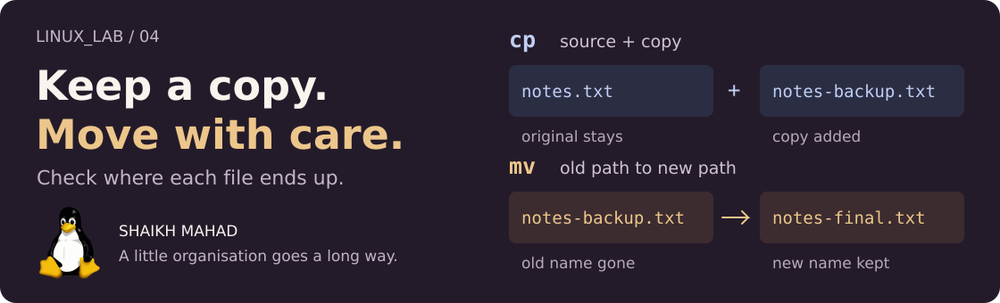

[LINUX_LAB](../../../README.md) / [Linux commands](../../../README.md#what-im-learning) / **04**

# Copying, Moving, and Deleting

<picture>
  <source media="(max-width: 620px)" srcset="../../../assets/lessons/copying-moving-and-deleting-mobile.svg">
  
</picture>

Now that I can create a file and read it, I want to organise it: keep a copy, give it a better name, put it in the right folder, and remove the extras when I'm done.

The commands are short. The part I want to get right is **which file will be where afterwards**. We'll work through one small project and check that as we go.

[Set up](#a-fresh-place-to-practise) · [Copy](#cp-keep-the-original) · [Copy folders](#copy-a-folder-and-its-contents) · [Move and rename](#mv-change-the-location-or-name) · [Remove](#rm-remove-a-file) · [Practise](#your-turn-pack-up-a-lab-session) · [Revise](#quick-revision)

> **By the end:** copy a project, move and rename files, recognise an overwrite, and choose between removing a file, an empty folder, and a whole folder tree.
>
> **Before starting:** use Bash on Linux or Ubuntu in WSL. [Files and Directories](../02-files-and-directories/README.md) and [Viewing File Content](../03-viewing-file-content/README.md) cover the creation and inspection commands used here.

## A fresh place to practise

I've included a tiny project so we have actual text to inspect. From the root of your cloned `LINUX_LAB` repo:

```bash
cd learning/linux-commands/04-copying-moving-and-deleting
ls -a examples/project
```

| Supplied file | What's inside |
| :--- | :--- |
| [notes.txt](examples/project/notes.txt) | Three reminders for this chapter. |
| [checklist.txt](examples/project/checklist.txt) | Three things to check before finishing a lab session. |
| [.gitignore](examples/project/.gitignore) | A small Git ignore rule, included so the project has a hidden file too. |

Make a new practice folder and copy the supplied project into it:

```bash
mkdir -p ~/linux-lab-practice
practice_dir=$(mktemp -d ~/linux-lab-practice/file-ops.XXXXXX)
cp -r examples/project "$practice_dir/"
cd "$practice_dir"
mkdir backups archive
pwd
```

`mktemp -d` creates a fresh directory, replacing the six `X` characters with a random suffix. `practice_dir` holds the path so we can enter it. This small bit of Bash lets you start a new run without reusing an old practice folder; the [variables chapter](../../bash-scripting/02-variables-and-expansion/README.md) explains that syntax further.

The `cp -r` line gives us a working copy of the project. We'll unpack that command below. If the setup reports an error, resolve it before continuing. Your `pwd` should end in something like `linux-lab-practice/file-ops.aB3k9Z`.

**Stay in that new folder for the rest of the chapter.** The files in the repo are our starting material; the copies here are the ones we'll change and delete. The practice folder stays on disk until you choose to remove it.

Check the starting files:

```bash
ls -a project
cat project/notes.txt
```

The note reads:

```text
Linux lab notes
Check the source and destination.
Read the copy before removing anything.
```

## Which command fits the job?

| Job | Command | What happens to the source? |
| :--- | :--- | :--- |
| Make a copy | `cp` | It stays at its original path. |
| Move or rename | `mv` | After a successful move, its old path is gone. |
| Remove a file | `rm` | That file path is removed. |
| Remove an empty directory | `rmdir` | The directory is removed only if empty. |

For copying and moving, the usual order is `COMMAND SOURCE DESTINATION`: the file you have first, then the path you want it to reach.

## Cp: keep the original

```bash
cp project/notes.txt notes-backup.txt
cat notes-backup.txt
```

```text
Linux lab notes
Check the source and destination.
Read the copy before removing anything.
```

There are now two ordinary files with the same contents: `project/notes.txt` and `notes-backup.txt`. Editing one won't edit the other. The cover shows this as **source + copy**.

### Copy into an existing folder

```bash
cp project/notes.txt backups/
```

The new path is `backups/notes.txt`. Because `backups/` is a directory, `cp` keeps the source filename inside it.

To give a copy a different name at the same time:

```bash
cp -v project/checklist.txt backups/lab-checklist.txt
```

Typical English output:

```text
'project/checklist.txt' -> 'backups/lab-checklist.txt'
```

`-v` means verbose: show what was copied. Without it, a successful `cp` normally prints nothing. The copied checklist is still separate from the original.

### Ask before replacing something

Plain `cp` can overwrite an existing writable destination file without asking. Let's deliberately aim the checklist at the notes copy and refuse the overwrite:

```bash
cp -i project/checklist.txt backups/notes.txt
```

You'll get a prompt like:

```text
cp: overwrite 'backups/notes.txt'?
```

Type **`n`**, then press <kbd>Enter</kbd>. `-i` asks before overwriting; it doesn't automatically refuse for you. Now check what stayed there:

```bash
head -n 1 backups/notes.txt
```

```text
Linux lab notes
```

The checklist didn't replace the note. If you choose `y` instead, `backups/notes.txt` gets the checklist's contents. You can combine options, as in `cp -iv`, to ask and show completed copies.

## Copy a folder and its contents

Directories need a recursive copy. `-r` tells `cp` to work through the folder and the entries inside it:

```bash
cp -r project project-copy
ls -a project-copy
```

You'll find `.gitignore`, `checklist.txt`, and `notes.txt` in `project-copy`. The `.` and `..` entries shown by `ls -a` aren't additional copies of your files.

**`project-copy` did not exist before this command.** That matters. Now copy the same source into a directory that already exists:

```bash
cp -r project archive/
ls -a archive/project
```

This copy lives at **`archive/project/`**. The result isn't the same as placing the project's files directly in `archive/`.

| Destination before the command | Command | Where the copied note ends up |
| :--- | :--- | :--- |
| `project-copy` doesn't exist | `cp -r project project-copy` | `project-copy/notes.txt` |
| `archive/` already exists | `cp -r project archive/` | `archive/project/notes.txt` |

These rows explain the two commands we just ran. Don't repeat them to get the same starting result: now `project-copy` exists, another `cp -r project project-copy` would create `project-copy/project/`.

The trailing slash in `backups/` and `archive/` makes the directory destination clear. With an ordinary file source, `cp file missing-name` can create a file named `missing-name`; `cp file missing-name/` reports an error if that directory doesn't exist.

<details>
<summary><strong>Copy the contents of a folder, including hidden files</strong></summary>

This optional example uses another destination, so it won't change the main walkthrough:

```bash
mkdir contents-copy
cp -a project/. contents-copy/
ls -a contents-copy
```

`project/.` refers to the contents at that directory level. The result contains `.gitignore`, `checklist.txt`, and `notes.txt` directly inside `contents-copy`, with no extra `project` folder.

`-a` is an **archive copy**: it includes recursion and attempts to preserve attributes such as permissions and timestamps. It also preserves symbolic links as links. What can be preserved depends on permissions and filesystem support; it isn't an archive file such as a ZIP.

By default, Bash's `project/*` glob skips names beginning with a dot. Copying the directory or using `project/.` includes those entries. That's why the supplied project includes a `.gitignore` file to check.

</details>

## Mv: change the location or name

Move our loose backup into the archive:

```bash
mv -v notes-backup.txt archive/
```

Typical English output:

```text
renamed 'notes-backup.txt' -> 'archive/notes-backup.txt'
```

`notes-backup.txt` is no longer in the practice folder's top level. It is now `archive/notes-backup.txt`. The original `project/notes.txt` is still there because we moved the **copy**.

### Rename the file in place

```bash
mv archive/notes-backup.txt archive/notes-final.txt
```

The file stays in `archive/` and gets a new name. A simple rename uses the same `mv` command as a move.

### Move and rename together

```bash
mv backups/lab-checklist.txt "archive/lab checklist.txt"
cat "archive/lab checklist.txt"
```

```text
Check my location.
Keep a copy of the notes.
Check the finished files.
```

The destination contains a space, so keep it quoted. The old `backups/lab-checklist.txt` path is gone.

You can rename a directory too:

```bash
mv project-copy practice-copy
```

`practice-copy` didn't already exist, so this renames the copied folder. `mv` includes the folder's contents without needing `-r`.

### Moving can overwrite too

Use `mv -i` when you want a prompt before an existing file is replaced. Try this on our copies:

```bash
mv -i backups/notes.txt archive/notes-final.txt
```

At the overwrite prompt, type **`n`**, then Enter. Both paths remain. Had you answered `y`, the destination would be replaced and the source path would disappear after a successful move.

Like `cp`, `mv` treats an existing directory destination as a folder to move **into**. It doesn't merge two nonempty directory trees with the same name.

<details>
<summary><strong>Why moving to another drive can take longer</strong></summary>

Within one filesystem, a move can usually rename the existing entry. Across filesystems, GNU `mv` copies the data and removes the source after the copy succeeds. A move to another drive can therefore take time and need free space there.

The result to check is still the same: the file is at its destination and no longer at the old source path. The files we use here all live in one practice folder.

</details>

## Rm: remove a file

Our notes are already saved in the project and archive. Remove the extra copy in `backups`:

```bash
rm -i backups/notes.txt
```

At a prompt like `rm: remove regular file 'backups/notes.txt'?`, type **`y`**, then Enter. Now check:

```bash
ls -A backups
```

No output means this folder has no entries other than `.` and `..`. `ls -A` includes hidden names while leaving out those two special entries.

**`rm` doesn't send files to the desktop Trash or Recycle Bin.** There is no built-in undo here. Read the path before confirming; we are removing a practice copy we made in this walkthrough.

`rm -i` asks before each removal. `rm -v` reports successful removals, and plain `rm file` normally succeeds quietly for an ordinary writable file.

## Rmdir: when the folder should be empty

`backups` is empty now, so:

```bash
rmdir backups
```

The directory is removed. Compare that with our copied project, which still contains files:

```bash
rmdir practice-copy
```

Expected failure, with wording that may vary by system language:

```text
rmdir: failed to remove 'practice-copy': Directory not empty
```

That failure is useful information. `rmdir` leaves the nonempty directory in place. Hidden entries count too: a folder containing only `.gitignore` is still not empty.

## Remove a folder and everything inside it

Inspect the disposable copy first:

```bash
ls -a practice-copy
```

This is the renamed copy, containing `.gitignore`, `checklist.txt`, and `notes.txt`. Remove that tree:

```bash
rm -r -- practice-copy
```

`-r` includes the directory's contents, including hidden entries. `--` ends option processing; everything after it is treated as a path. It is also useful for names that begin with `-`.

We still have `project/` and `archive/project/`. Check the original note:

```bash
head -n 1 project/notes.txt
```

```text
Linux lab notes
```

<details>
<summary><strong>The difference between -r, -i, -I, and -f</strong></summary>

| Option | What GNU rm does |
| :--- | :--- |
| `-r` | Removes a directory tree recursively. It can still prompt in some situations. |
| `-i` | Asks before each removal. With recursion, it can also ask before descending into a directory. |
| `-I` | Asks once before a recursive removal or an operation with more than three files. This is a capital `I`. |
| `-f` | Ignores missing files and never prompts. It does not bypass filesystem permissions. |

`rm -rf` combines recursion and force. You may see it in scripts, but it isn't required for this walkthrough. Adding `-f` to `-i` doesn't give extra protection: the later of those two options takes precedence.

**Recursion belongs to the command:** `cp -r` copies a tree, while `rm -r` removes one. `mv` moves directories without a recursive option.

</details>

## Your turn: pack up a lab session

Keep working in the same practice folder. `project/` and its original notes are still available.

1. Create an empty folder called `submission`.
2. Copy `project/notes.txt` into it under the name `revision.txt`.
3. Rename that copy to `linux-revision.txt`.
4. Read it and check that the original note still exists.
5. Remove just the submission copy, then remove the now-empty `submission` folder.

Which commands need a source and a destination? Which command checks that the folder is empty?

<details>
<summary><strong>Compare your workflow</strong></summary>

```bash
mkdir submission
cp project/notes.txt submission/revision.txt
mv submission/revision.txt submission/linux-revision.txt
cat submission/linux-revision.txt
cat project/notes.txt
```

Both `cat` commands print the same three-line note. `cp` kept the source; `mv` changed only the copy's name.

Then remove the copy. Answer **`y`** to the prompt:

```bash
rm -i submission/linux-revision.txt
```

```bash
rmdir submission
```

The project stays in place. `cp` and `mv` took a source and destination; `rmdir` checked that `submission` was empty before removing it.

</details>

## When a file isn't where you expected

| What happened | What to check |
| :--- | :--- |
| A command says `No such file or directory`. | Check `pwd`, spelling, case, and whether an earlier `mv` changed the path. |
| `cp` says it is omitting a directory. | Copying a directory needs recursion, such as `cp -r`. |
| A copy ended up one folder deeper. | The destination directory already existed, so the source was copied inside it. |
| A name with spaces was split up. | Quote the full path, such as `"archive/lab checklist.txt"`. |
| `rmdir` says the directory isn't empty. | Use `ls -A directory` to check for both visible and hidden entries. |
| A command succeeds without printing anything. | That is normal for these tools. Inspect the destination; use `-v` when you want a report. |
| An overwrite prompt appears unexpectedly. | Your shell may define an alias with `-i`. `type cp`, `type mv`, or `type rm` shows what the name resolves to. |

## Quick revision

These are command patterns for revision. Replace the names with your own paths before using them.

| Job | Pattern |
| :--- | :--- |
| Copy a file | `cp source.txt copy.txt` |
| Copy into an existing folder | `cp source.txt destination/` |
| Ask before overwriting a copy | `cp -i source.txt copy.txt` |
| Copy a whole directory | `cp -r source-directory new-directory` |
| Copy contents and preserve attributes where possible | `cp -a source-directory/. destination/` |
| Move or rename | `mv -i old-path new-path` |
| Remove a file with confirmation | `rm -i -- file.txt` |
| Remove an empty directory | `rmdir directory` |
| Remove a directory tree, asking once | `rm -rI -- directory` |

**Before moving on:** explain why `cp -r project archive/` and `cp -a project/. archive/` put files in different places. Then explain why moving a copy doesn't remove the original it was copied from.

<details>
<summary><strong>References behind these notes</strong></summary>

- GNU Coreutils: [cp](https://www.gnu.org/software/coreutils/manual/html_node/cp-invocation.html), [mv](https://www.gnu.org/software/coreutils/manual/html_node/mv-invocation.html), [rm](https://www.gnu.org/software/coreutils/manual/html_node/rm-invocation.html), and [rmdir](https://www.gnu.org/software/coreutils/manual/html_node/rmdir-invocation.html).
- GNU Coreutils: [target directories](https://www.gnu.org/software/coreutils/manual/html_node/Target-directory.html) and [mktemp](https://www.gnu.org/software/coreutils/manual/html_node/mktemp-invocation.html).
- Local help: `man cp`, `man mv`, `man rm`, and `man rmdir`.
- [Chapter artwork and Tux credit](../../../assets/README.md#lesson-covers).

</details>

## A place for everything, then a way to find it

We copied a project, moved its loose files into an archive, and removed the extras. Next I want to find a file without opening every folder, and look for useful lines inside it.

**[Continue to 05: Searching and Finding](../05-searching-and-finding/README.md)**

[Previous: Viewing File Content](../03-viewing-file-content/README.md) · [All learning topics](../../../README.md#what-im-learning) · [Back to the top](#copying-moving-and-deleting)

Notes by **Shaikh Mahad**. If a step leaves you with a different result, [open an issue with the command and your output](https://github.com/codewithmahad/LINUX_LAB/issues). A clear example helps me improve these notes too.
