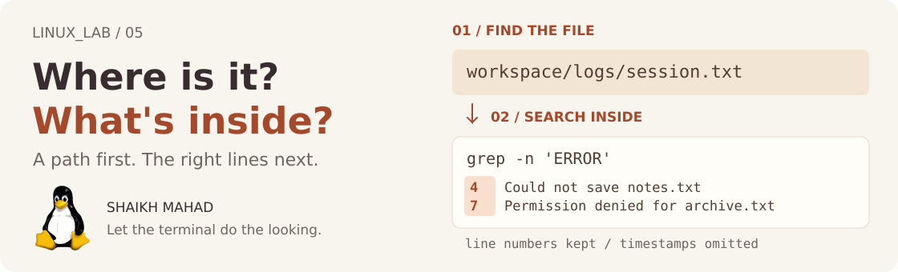

[LINUX_LAB](../../../README.md) / [Linux commands](../../../README.md#what-im-learning) / **05**

# Searching and Finding

<picture>
  <source media="(max-width: 620px)" srcset="../../../assets/lessons/searching-and-finding-mobile.svg">
  
</picture>

Opening every folder works for a while. Opening every file to find one error gets old much faster. This is where I want the terminal to do the looking for me.

There are two different questions here: **where is the file**, and **which lines inside it matter**? I'll use `find` for the first and `grep` for the second.

[Get the files](#a-small-folder-to-investigate) · [Search text](#grep-find-the-lines-that-matter) · [Find files](#find-start-with-a-place-to-look) · [Practise](#your-turn-follow-the-clues) · [Revise](#quick-revision)

> **By the end:** find a file by name, narrow a search to a folder or file type, and pull useful lines out of a log.
>
> **Before starting:** use Bash on Linux or Ubuntu in WSL. [Navigation and Paths](../01-navigation-and-paths/README.md) and [Viewing File Content](../03-viewing-file-content/README.md) cover the commands we'll build on. You don't need the earlier practice folders.

## A small folder to investigate

From the root of your cloned `LINUX_LAB` repo:

```bash
cd learning/linux-commands/05-searching-and-finding
pwd
ls examples/workspace
```

Stay in this chapter folder for all the examples. I've included four small files:

| Folder | File | What to notice |
| :--- | :--- | :--- |
| `notes/` | [commands.txt](examples/workspace/notes/commands.txt) | Three command reminders. |
| `notes/` | [lab notes.txt](examples/workspace/notes/lab%20notes.txt) | A filename with a space. |
| `archive/` | [COMMANDS.TXT](examples/workspace/archive/COMMANDS.TXT) | Uppercase letters, including the extension. |
| `logs/` | [session.txt](examples/workspace/logs/session.txt) | An eight-line example log with two errors. |

The log is made up for practice. It is plain text, so a `.txt` file works just as well here as a `.log` file.

Read it once so you know what you're searching:

```bash
cat examples/workspace/logs/session.txt
```

```text
09:00 INFO  Session started
09:01 INFO  Reading notes.txt
09:02 WARN  Backup folder is missing
09:03 ERROR Could not save notes.txt
09:04 INFO  Created the backup folder
09:05 INFO  Retried the backup
09:06 ERROR Permission denied for archive.txt
09:07 INFO  Session finished
```

## Grep: find the lines that matter

Start with a pattern and a file:

```bash
grep 'ERROR' examples/workspace/logs/session.txt
```

```text
09:03 ERROR Could not save notes.txt
09:06 ERROR Permission denied for archive.txt
```

`grep` prints **whole matching lines** by default. It doesn't change the file. Here it searches for the uppercase text `ERROR` anywhere on each line.

### Keep the line numbers

```bash
grep -n 'ERROR' examples/workspace/logs/session.txt
```

```text
4:09:03 ERROR Could not save notes.txt
7:09:06 ERROR Permission denied for archive.txt
```

The `4:` and `7:` are line numbers, not part of the timestamps. This is the version I'd use when asking someone to look at a particular error.

### Change what you ask for

Try these one at a time:

| Command | Result in this sample |
| :--- | :--- |
| `grep -in 'error' examples/workspace/logs/session.txt` | The same two errors, ignoring letter case. |
| `grep -c 'ERROR' examples/workspace/logs/session.txt` | `2`, the number of matching lines. |
| `grep -v 'INFO' examples/workspace/logs/session.txt` | The warning and both errors. |
| `grep -n -A 2 'WARN' examples/workspace/logs/session.txt` | The warning plus the next two lines, with line numbers. |

`-c` counts matching **lines**, even if a word appears several times on one line. `-A 2` means two lines **after** a match; `-B 2` shows two before, and `-C 2` shows two on each side.

### Search for literal text

By default, `grep` treats its pattern as a *regular expression*. Characters such as `.` can have a special meaning. Use `-F` when you just want the text you typed:

```bash
grep -nF 'notes.txt' examples/workspace/logs/session.txt
```

```text
2:09:01 INFO  Reading notes.txt
4:09:03 ERROR Could not save notes.txt
```

With `-F`, the dot is an actual dot. The quotes keep Bash from interpreting the pattern; `-F` tells **grep** to read it literally. Those are separate jobs.

### A little pattern matching

Sometimes one fixed string isn't enough. `-E` enables extended regular expressions:

```bash
grep -nE 'WARN|ERROR' examples/workspace/logs/session.txt
```

```text
3:09:02 WARN  Backup folder is missing
4:09:03 ERROR Could not save notes.txt
7:09:06 ERROR Permission denied for archive.txt
```

Inside this quoted pattern, `|` means **or**. Bash passes it to `grep`; it isn't a shell pipe here.

<details>
<summary><strong>A few patterns worth recognising</strong></summary>

| Pattern or option | Meaning | Example to try |
| :--- | :--- | :--- |
| `^` | Start of a line. | `grep '^09:00' examples/workspace/logs/session.txt` |
| `$` | End of a line. | `grep 'finished$' examples/workspace/logs/session.txt` |
| `.` | Any single character. | `grep 'notes.txt' examples/workspace/logs/session.txt` also permits a different character in place of the dot. |
| `[.]` | A literal dot in a regular expression. | `grep 'notes[.]txt$' examples/workspace/logs/session.txt` |
| `-w` | Require a whole-word match. | `grep -w 'INFO' examples/workspace/logs/session.txt` |

For `-w`, letters, digits, and underscores belong to a word. The flags `-F` and `-E` choose different pattern modes; use the one your search needs.

You don't need a whole regex course to start. I keep these here because they explain why a search sometimes matches more than I meant.

</details>

### Search a folder's contents

```bash
grep -rnF --include='*.txt' 'Revision' examples/workspace
```

```text
examples/workspace/notes/lab notes.txt:1:Revision: practise paths and quoting.
```

`-r` searches through the folder and its subfolders. `-n` keeps line numbers, and `--include='*.txt'` limits this search to filenames ending in lowercase `.txt`. Recursive output includes the file path, which is useful when you don't already know where the match lives.

If you only need the filenames, use lowercase `-l`:

```bash
grep -rlF 'Revision' examples/workspace
```

It prints `examples/workspace/notes/lab notes.txt` once. `-l` is a letter, not the number `1`.

## Find: start with a place to look

`find` walks through a directory tree. These examples print matching paths; they don't search the text inside those files.

```bash
find examples/workspace -type f -name 'session.txt'
```

```text
examples/workspace/logs/session.txt
```

Read that command in three pieces:

| Part | Job |
| :--- | :--- |
| `examples/workspace` | Start looking here, including subfolders. |
| `-type f` | Match regular files. Use `-type d` for directories. |
| `-name 'session.txt'` | Match this filename. |

The tests are combined with **and** by default: the entry must be a regular file **and** have that name. Use `.` as the starting path to search the current directory instead.

### Match an extension, then check case

```bash
find examples/workspace -type f -name '*.txt'
```

These three paths match; `find` may print them in a different order:

```text
examples/workspace/notes/commands.txt
examples/workspace/notes/lab notes.txt
examples/workspace/logs/session.txt
```

Now ignore case:

```bash
find examples/workspace -type f -iname '*.txt'
```

The uppercase `examples/workspace/archive/COMMANDS.TXT` also matches, giving four files.

**Keep the quotes around `*.txt`.** Without them, Bash may expand the pattern using files in your current directory before `find` sees it. `-name` matches the filename at the end of a path, not the whole path.

Also, this `*.txt` is a **filename wildcard pattern**. It is not the same pattern language as a `grep` regular expression.

### Control how far down to look

```bash
find examples/workspace -maxdepth 1 -type d
```

This lists the starting directory and its three immediate subdirectories. Add `-mindepth 1` to leave out the starting directory itself:

```bash
find examples/workspace -mindepth 1 -maxdepth 1 -type d
```

```text
examples/workspace/notes
examples/workspace/archive
examples/workspace/logs
```

Again, the order can differ. The starting point is depth **0**, its children are depth **1**, and the files in those child folders are depth **2**.

<details>
<summary><strong>Other useful questions: empty files, size, and modification time</strong></summary>

Run these from the same chapter folder:

```bash
find examples/workspace -type f -empty
find examples/workspace -type f -size +1k
find examples/workspace -type f -mmin -60
```

- `-empty` selects empty regular files here. None of the supplied files are empty.
- `-size +1k` selects files larger than 1,024 bytes. These small examples don't match it.
- `-mmin -60` selects files whose contents were modified less than 60 minutes ago. Your results depend on the files' timestamps, including when your checkout created them.

Size tests use units: `c` means bytes, `k` means 1,024-byte units, and `M` means 1,048,576-byte units. GNU `find` rounds sizes up to the selected unit before comparing, so use bytes when an exact boundary matters.

The modification time is the `mtime` from [Files and Directories](../02-files-and-directories/README.md). It isn't the file's creation time.

</details>

<details>
<summary><strong>One step further: find the files, then search their contents</strong></summary>

```bash
find examples/workspace -type f -name '*.txt' -exec grep -nH -F 'Revision' {} +
```

This produces the same matching line from `lab notes.txt` as the earlier recursive `grep` example.

`-exec` runs a command on the matched files. `{}` is where `find` supplies their paths, and `+` groups paths into batches. `grep -H` always prints the filename, even if a batch contains just one file.

The space in `lab notes.txt` stays part of its filename. `find` passes each path as a separate argument, so there's no need to split a printed list of filenames yourself.

For a simple text search, `grep -r` is shorter. This combination becomes useful when you need `find` tests such as size or modification time as well.

</details>

<details>
<summary><strong>Where does locate fit?</strong></summary>

You may see `locate` or `plocate` in other Linux notes. They search an index of paths, which can make a broad filename search fast. A recently created file may be missing from that index, and a deleted file may still appear until the index is refreshed.

`find` examines the directory tree as it runs. It doesn't need that index. For these exercises, it also gives us a small, predictable place to search. If `locate` isn't installed, you can still do this whole chapter.

</details>

## Your turn: follow the clues

Stay in this chapter folder. Try these before opening the answers:

1. Find both files named `commands.txt`, ignoring letter case.
2. Print the warning and errors from the log with their line numbers.
3. Find which file contains the literal text `Revision`, printing only its path.
4. Count the log lines that contain `INFO`. Predict the result first.
5. Search for `DEBUG`. If nothing prints, how would you tell “no match” from an error?

<details>
<summary><strong>Compare your commands and answers</strong></summary>

```bash
find examples/workspace -type f -iname 'commands.txt'
grep -nE 'WARN|ERROR' examples/workspace/logs/session.txt
grep -rlF 'Revision' examples/workspace
grep -c 'INFO' examples/workspace/logs/session.txt
grep 'DEBUG' examples/workspace/logs/session.txt
echo "$?"
```

1. The paths are `examples/workspace/notes/commands.txt` and `examples/workspace/archive/COMMANDS.TXT`.
2. Lines **3, 4, and 7** match.
3. The path is `examples/workspace/notes/lab notes.txt`.
4. There are **5** `INFO` lines.
5. `grep` prints nothing, and the immediately following `echo "$?"` prints **1**.

For these GNU `grep` searches, exit status **0** means a matching line was selected, **1** means none were selected, and **2** means an error. Check `$?` straight after the command because another command replaces that status. The [Bash notes on exit status](../../bash-scripting/04-operators-and-expressions/README.md#exit-status) explain this further.

</details>

## When the result surprises you

| What happened | What to check |
| :--- | :--- |
| `grep` prints nothing. | Check the path, spelling, and case. A valid search can have no matches. |
| `grep` waits after you supplied only a pattern. | It is waiting for standard input. Press Ctrl+C, then provide the file path. |
| `find` misses an uppercase extension. | `-name` is case-sensitive; try `-iname`. |
| `find` complains about paths or expressions. | Put the starting path first and quote wildcard patterns. |
| A search through `/` prints `Permission denied`. | Start with a folder you can read, such as this chapter's `examples/workspace`. A partial search isn't a complete result. |
| `grep -c` returns fewer than the number of repeated words you counted. | It counts matching lines, not individual occurrences. |

## Quick revision

| I know… | Reach for… |
| :--- | :--- |
| The text I'm looking for | `grep -nF 'text' file` |
| The text, but not its letter case | `grep -niF 'text' file` |
| Two possible patterns | `grep -nE 'one\|two' file` |
| I only need matching filenames | `grep -rlF 'text' directory` |
| The filename | `find directory -type f -name 'name.txt'` |
| Only the extension | `find directory -type f -name '*.txt'` |
| I only want immediate subdirectories | `find directory -mindepth 1 -maxdepth 1 -type d` |

`file` and `directory` above are placeholders. **Before moving on:** explain why `grep -F '*.txt' file` looks for the literal text `*.txt`, while `find directory -name '*.txt'` looks for filenames with that extension.

<details>
<summary><strong>References behind these notes</strong></summary>

- GNU Grep: [manual](https://www.gnu.org/software/grep/manual/grep.html), [matching control](https://www.gnu.org/software/grep/manual/html_node/Matching-Control.html), and [exit status](https://www.gnu.org/software/grep/manual/html_node/Exit-Status.html).
- GNU Findutils: [filename patterns](https://www.gnu.org/software/findutils/manual/html_node/find_html/Base-Name-Patterns.html), [directory depth](https://www.gnu.org/software/findutils/manual/html_node/find_html/Directories.html), and [manual](https://www.gnu.org/software/findutils/manual/html_mono/find.html).
- Local help: `man grep`, `man find`, and `man locate` if your system has it.
- [Chapter artwork and Tux credit](../../../assets/README.md#lesson-covers).

</details>

## Found it. Now what?

Finding the right file is a good start. Next I want to count its lines, pick out a column, sort the results, and turn repeated entries into something useful.

**[Continue to 06: Text Processing](../06-text-processing/README.md)**

[Previous: Copying, Moving, and Deleting](../04-copying-moving-and-deleting/README.md) · [All learning topics](../../../README.md#what-im-learning) · [Back to the top](#searching-and-finding)

Notes by **Shaikh Mahad**. If a command behaves differently on your setup, [open an issue with the command and output](https://github.com/codewithmahad/LINUX_LAB/issues). I'm keeping these useful for my own revision too.
